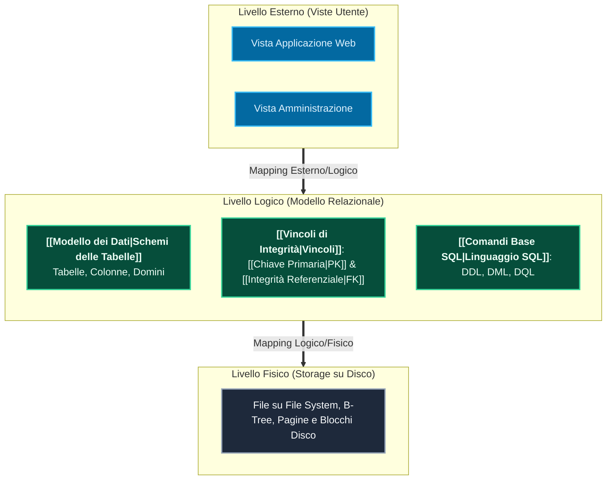
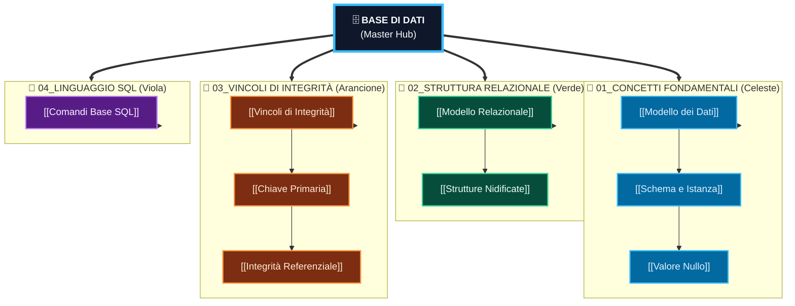

---
aliases:
  - Base di Dati
  - Basi di Dati
  - Master Hub Base di Dati
tags:
  - università/base-di-dati
  - hub
date: 2026-10-01
---

# 🗄️ Base di Dati — Master Hub

> [!ABSTRACT] 📌 File Principale & Master Hub del Corso
> Questa nota rappresenta il **File Principale** del corso di **Base di Dati**.  
> Funge da guida sintetica per l'esame: per ciascun tema trovi il **concetto fondamentale**, la **formalizzazione relazionale** e il link diretto alla relativa nota di dettaglio.

---

## 🏗️ 1. Architettura a Tre Livelli di un DBMS

I moderni Database Management System (DBMS) separano la visione dell'utente dalla memorizzazione fisica su disco tramite l'architettura a 3 livelli ANSI/SPARC:

---

## 📋 2. Quadro Sinottico: Cosa C'è da Sapere per Ogni Argomento

| Modulo | Argomento & Nota | 🎯 Concetto Chiave da Sapere | 📌 Regola Fondamentale / Esempio | 💡 Significato Pratico |
|---|---|---|---|---|
| **01** | **[[Modello dei Dati]]** | Definizione formale di modello logico vs concettuale. | Dati strutturati vs non strutturati | Permette l'indipendenza fisica dei dati dalle applicazioni. |
| **01** | **[[Schema e Istanza]]** | Schema (intensione invariante) vs Istanza (estensione temporale). | Schema = DDL (`CREATE`) Istanza = tuple attuali | Lo schema cambia raramente; l'istanza muta ad ogni `INSERT`/`DELETE`. |
| **01** | **[[Valore Nullo]]** | Il valore `NULL` denota assenza di valore, valore sconosciuto o inapplicabile. | Logica a tre valori (True, False, Unknown) | `NULL` non è né zero né stringa vuota: richiede predicati `IS NULL`. |
| **02** | **[[Modello Relazionale]]** | Relazione come sottoinsieme del prodotto cartesiano dei domini. | Tuple ordinate per nome attributo | Righe non ordinate, tuple distinte (nessun duplicato formale). |
| **02** | **[[Strutture Nidificate]]** | Modello relazionale piatto (1NF) vs strutture complesse/XML/JSON. | Prima Forma Normale: valori atomici | Tutti i campi devono contenere un valore elementare indivisibile. |
| **03** | **[[Vincoli di Integrità]]** | Predicati booleani che ogni istanza valida deve obbligatoriamente soddisfare. | Vincoli intra-relazionali vs inter-relazionali | Impediscono la corruzione dei dati a livello di DBMS. |
| **03** | **[[Chiave Primaria]]** | Insieme minimale di attributi che identifica univocamente ogni tupla. | `PRIMARY KEY` (Univoca + `NOT NULL`) | Identità della riga; impedisce duplicati logici nella tabella. |
| **03** | **[[Integrità Referenziale]]** | Vincolo che lega una chiave esterna (FK) alla chiave primaria di un'altra tabella. | `FOREIGN KEY (d) REFERENCES T(id)` | Impedisce tuple "orfane"; politiche `CASCADE` o `SET NULL` su cancellazione. |
| **04** | **[[Comandi Base SQL]]** | I tre sottoinsiemi: DDL (definizione), DML (manipolazione), DQL (interrogazione). | `SELECT ... FROM ... WHERE ... GROUP BY` | Standard universale dichiarativo: descrivi *cosa* vuoi, non *come* estrarlo. |

---

## 🌳 3. Mappa Concettuale Ramificata ad Albero Puro

