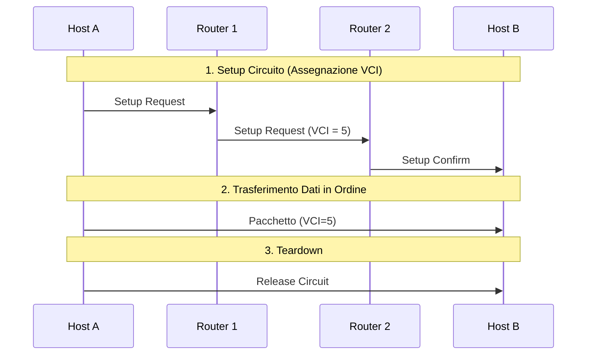

---
aliases:
  - Circuito Virtuale
  - Virtual Circuit
tags:
  - università/reti-di-calcolatori
  - commutazione
date: 2026-09-29
---

# 🔗 Circuito Virtuale

Approccio **orientato alla connessione (*connection-oriented*)** nella [[Commutazione di Pacchetto]].

I pacchetti seguono tutti lo stesso percorso logico prefissato, condividendo le linee con altri flussi.

> [!INFO] Fasi Operative
> 1. **Setup**: Viene stabilito il percorso e assegnato un identificatore di circuito virtuale (**VCI** - *Virtual Circuit Identifier*).
> 2. **Trasferimento dati**: I pacchetti contengono solo il VCI (header ridotto) e arrivano **in ordine**.
> 3. **Teardown**: Rilascio del circuito e cancellazione dello stato nei nodi.

---

### Caratteristiche:
- **Consegna ordinata** dei pacchetti.
- **Header leggero** (trasporta solo il VCI, non l'indirizzo IP completo).
- I router mantengono lo **stato** della connessione.
- Se un nodo sul percorso cade, il circuito virtuale si interrompe.
- **Esempi**: X.25, ATM, MPLS.

---

### 🧭 Navigazione Gerarchica
- ⬆️ **Nodo Padre:** [[Rete]]
- ⬅️ **Passo Precedente:** [[Datagramma]]
- ➡️ **Passo Successivo:** [[Modello ISO-OSI]]
