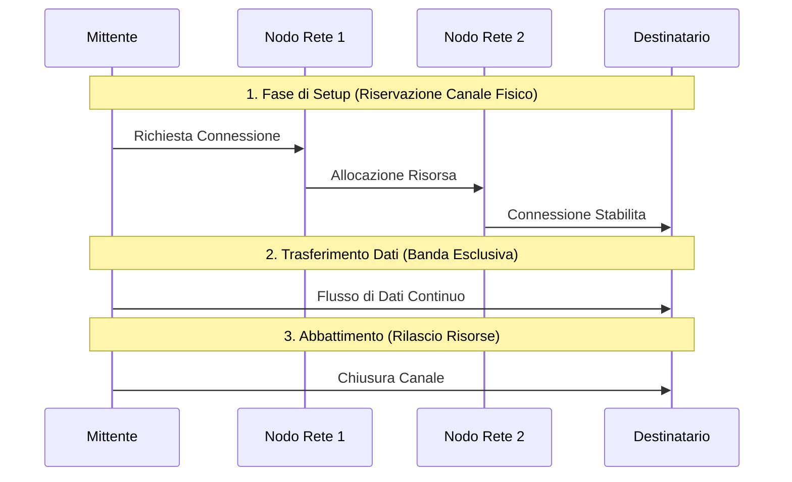

---
aliases:
  - Commutazione di Circuito
  - Circuit Switching
tags:
  - università/reti-di-calcolatori
  - commutazione
date: 2026-09-29
---

# 📞 Commutazione di Circuito

Nella **Commutazione di Circuito** (*Circuit Switching*) viene stabilito un canale fisico **dedicato ed esclusivo** tra mittente e destinatario prima dell'inizio del trasferimento dati.

> [!INFO] Caratteristiche Principali
> - **Banda riservata** (tramite FDM o TDM): Assenza di contesa e zero ritardo di accodamento (*queuing delay*).
> - **Inefficiente per traffico a raffica (*bursty*)**: Le risorse di rete restano occupate anche durante i periodi di inattività o silenzio tra i nodi.
> - **Esempio per eccellenza**: Rete telefonica tradizionale (PSTN).

---

### 🧭 Navigazione Gerarchica
- ⬆️ **Nodo Padre:** [[Rete]]
- ⬅️ **Passo Precedente:** [[Standard e Organismi]]
- ➡️ **Passo Successivo:** [[Commutazione di Pacchetto]]
