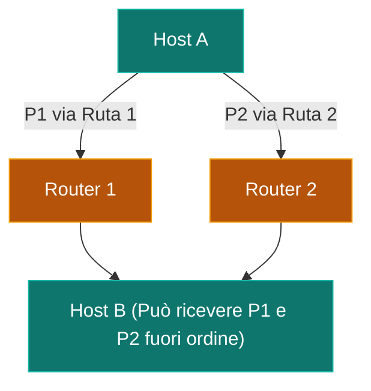

---
aliases:
  - Datagramma
  - Datagram
tags:
  - università/reti-di-calcolatori
  - commutazione
date: 2026-09-29
---

# ✉️ Datagramma

Approccio **senza connessione (*connectionless*)** nella [[Commutazione di Pacchetto]].

> [!INFO] Caratteristiche Principali
> - **Nessun Setup**: I pacchetti vengono inviati immediatamente senza preventiva instaurazione di una connessione.
> - **Pacchetti Indipendenti**: Ciascun pacchetto (datagramma) contiene l'indirizzo di destinazione completo e viene trattato autonomamente.
> - **Instradamento Dinamico**: Ogni router decide la rotta pacchetto per pacchetto in base alla propria tabella di routing e allo stato della rete.
> - **Affidabilità Best-Effort**: I pacchetti dello stesso flusso possono seguire percorsi diversi, arrivare **fuori ordine** o essere scartati in caso di congestione.
> - **Esempio per eccellenza**: Protocollo **IP** (Internet Protocol).

---

### 🧭 Navigazione Gerarchica
- ⬆️ **Nodo Padre:** [[Rete]]
- ⬅️ **Passo Precedente:** [[Commutazione di Pacchetto]]
- ➡️ **Passo Successivo:** [[Circuito Virtuale]]
