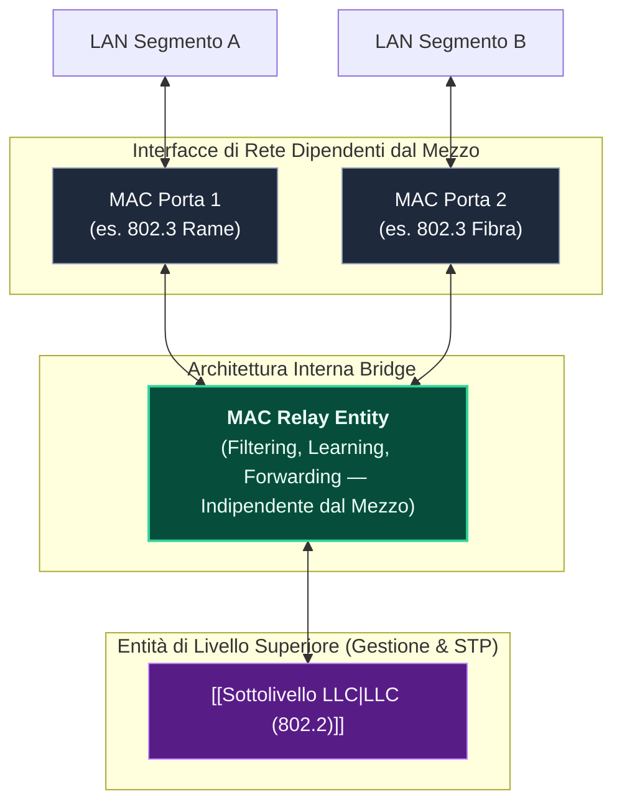
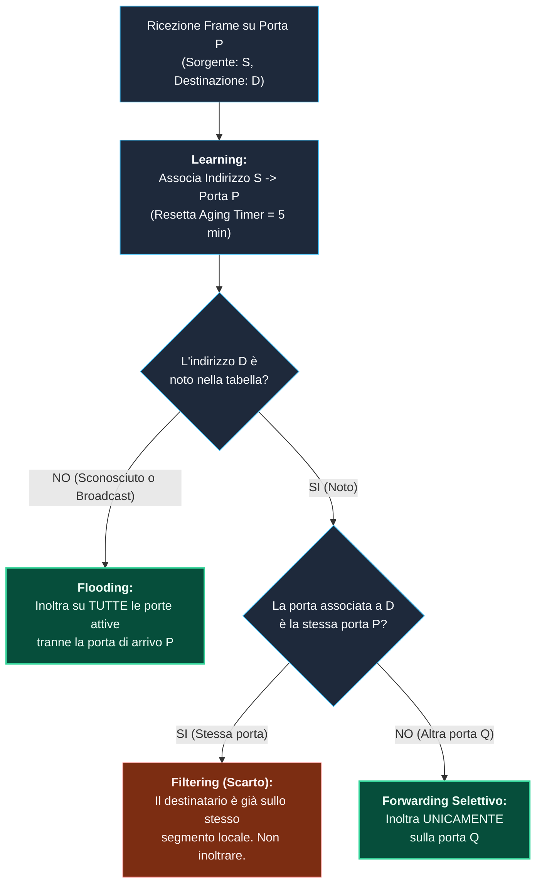
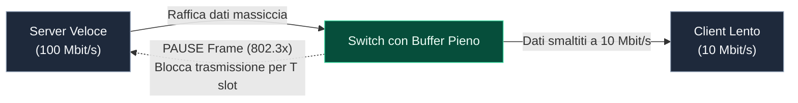

---
aliases:
  - Bridge
  - Switch
  - Bridge e Switch
  - Transparent Bridge
  - Filtering
tags:
  - università/reti-di-calcolatori
  - ieee802
  - bridge
  - switch
date: 2026-10-06
---

# 🌉 Bridge e Switch — Il Cuore delle Reti Locali

I **bridge** (e gli **switch**, che ne rappresentano l'evoluzione moderna) sono dispositivi di interconnessione di **Livello 2 (Data Link)** operanti nel **sottolivello MAC** dello standard **[[Progetto IEEE 802|IEEE 802]]** (standardizzati da **IEEE 802.1D**).

> [!ABSTRACT] Perché Sono Stati Introdotti?
> Collegare tra loro solo due computer tramite un singolo cavo [[LAN|Ethernet]] non consente di realizzare reti significative. I bridge nascono per interconnettere molteplici stazioni e segmenti di rete, permettendo la costruzione di **topologie di rete locale articolate, scalabili e ad alte prestazioni**.  
> Nella terminologia moderna e accademica, **bridge** e **switch** sono sinonimi funzionali: lo switch è un bridge multi-porta ad altissima velocità implementato con circuiti integrati dedicati (**ASIC**).

---

## 🎯 1. Contesto Architetturale & Transparent Bridging

> [!INFO] Scheda Tecnica del Bridge / Switch
> - **Livello ISO/OSI:** Livello 2 (Data Link) — Sottolivello MAC
> - **Unità Dati (PDU):** Frame (es. Frame Ethernet IEEE 802.3)
> - **Standard di riferimento:** **IEEE 802.1D** (Bridging), **IEEE 802.3x** (Flow Control)
> - **Trasparenza:** Sono definiti **Transparent Bridge** poiché i nodi finali ([[Indirizzi MAC|host]]) **ne ignorano totalmente l'esistenza**. Non è richiesta alcuna configurazione né modifica all'header dei pacchetti da parte degli host.

### Architettura Logica a Livelli (IEEE 802)
All'interno dello stack IEEE 802, il bridge si colloca a livello di **MAC Relay Entity**, posta al di sopra delle singole entità MAC di ciascuna porta fisica:

---

## 🚰 2. Funzione di Filtering e Modalità Store & Forward

Il compito primario del bridge è segmentare la rete locale mantenendo separati i flussi di traffico che non hanno bisogno di attraversarla.

### 1. Funzione di Filtering (Filtraggio)
Un bridge cerca di inoltrare solo i pacchetti che devono effettivamente transitare da una porzione della LAN all'altra:
- I **traffici locali** a un singolo segmento vengono confinati (*filtrati* e scartati dal bridge), riducendo le collisioni e liberando banda.
- Se la stazione $X$ trasmette alla stazione $Y$, i bridge intermedi cercano di **non trasmettere** il frame verso rami della LAN che non contengono il cammino verso $Y$.

### 2. Modalità Store & Forward (Memorizza e Ritrasmetti)
I bridge ritrasmettono i pacchetti secondo la logica **Store & Forward**:
1. **Store (Memorizzazione):** Il frame viene prima ricevuto **completamente** sulla porta di ricezione nel buffer di memoria, verificando la correttezza del checksum FCS (*Frame Check Sequence*). I frame corrotti vengono scartati prima della propagazione.
2. **Lookup:** Viene ispezionato l'indirizzo MAC di destinazione nella tabella di instradamento per determinare la porta di uscita.
3. **Forward (Ritrasmissione):** Il frame viene accodato nel buffer della porta di destinazione e ritrasmesso sul cavo.

> [!TIP] La Metafora Didattica delle Bottiglie d'Acqua (Prof. Di Battista)
> - Immagina ogni pacchetto come una **bottiglia** e i suoi bit come **l'acqua** che essa contiene.
> - Il cavo di trasmissione è un **tubo**.
> - Quando una stazione trasmette, versa la sua acqua nel tubo.
> - Il bridge in primo luogo **riempie completamente la bottiglia** corrispondente fino a quando l'acqua è arrivata tutta (*Store*).
> - Poi identifica la porta di uscita e mette la bottiglia in coda sul tubo di destinazione.
> - Infine, **versa l'acqua della bottiglia** nel tubo di ritrasmissione (*Forward*).

---

## 🧠 3. L'Algoritmo di Apprendimento (Backward Learning)

I bridge non richiedono alcuna configurazione manuale: costruiscono dinamicamente la propria tabella di inoltro (chiamata **Filtering Database** o tabella CAM) mediante l'algoritmo di **Backward Learning** (apprendimento all'indietro).

### Regole Fondamentali del Learning:
1. **L'apprendimento guarda il mittente ($MAC_{src}$):** Se un frame entra dalla porta 1 con mittente $U$, il bridge deduce che $U$ si trova sul segmento connesso alla porta 1.
2. **L'inoltro guarda il destinatario ($MAC_{dst}$):**
   - Se $MAC_{dst}$ è sulla stessa porta di arrivo: **Scarta (Filter)**.
   - Se $MAC_{dst}$ è su un'altra porta: **Inoltra (Forward)**.
   - Se $MAC_{dst}$ è sconosciuto o è un indirizzo di broadcast/multicast: **Inonda (Flood)** tutte le altre porte.
3. **Aging Time (Tempo di Sopravvivenza):** Le voci dinamiche della tabella hanno un tempo di scadenza di default di **5 minuti (300 secondi)** per consentire lo spostamento fisico dei computer senza bloccare l'instradamento.

### Esempio Pratico di Costruzione del Filtering Database:
Consideriamo un bridge a 2 porte con stazioni $U, V, W$ collegate alla Porta 1 e $X, Y, Z$ collegate alla Porta 2:

| Evento Trasmissivo | Mittente $\to$ Destinatario | Azione del Bridge | Voci Apprese Porta 1 | Voci Apprese Porta 2 |
|---|---|---|---|---|
| **Stato iniziale** | — | — | *(vuota)* | *(vuota)* |
| **1. $U \to V$** | $U$ invia a $V$ su P1 | **Flooding** su P2 ($V$ sconosciuto) | $\{U\}$ | $\emptyset$ |
| **2. $V \to U$** | $V$ invia a $U$ su P1 | **Filtering** (scarta: $U$ è su P1) | $\{U, V\}$ | $\emptyset$ |
| **3. $Z \text{ (Broadcast)}$** | $Z$ trasmette broadcast | **Flooding** su P1 | $\{U, V\}$ | $\{Z\}$ |
| **4. $Y \to V$** | $Y$ invia a $V$ su P2 | **Forwarding** solo su P1 | $\{U, V\}$ | $\{Z, Y\}$ |
| **5. $Y \to X$** | $Y$ invia a $X$ su P2 | **Flooding** su P1 ($X$ sconosciuto) | $\{U, V\}$ | $\{Z, Y\}$ |
| **6. $X \to W$** | $X$ invia a $W$ su P2 | **Flooding** su P1 ($W$ sconosciuto) | $\{U, V\}$ | $\{Z, Y, X\}$ |
| **7. $W \to Z$** | $W$ invia a $Z$ su P1 | **Forwarding** solo su P2 ($Z$ noto) | $\{U, V, W\}$ | $\{Z, Y, X\}$ |

---

## ⚡ 4. Analisi delle Prestazioni & Condizione di "Full Speed"

Un bridge influisce sulle prestazioni complessive dell'intera rete locale:
- **Throughput (PPS):** Numero massimo di pacchetti al secondo processabili.
- **Tempo di Latenza:** Tempo intercorso dall'ingresso del primo bit sulla porta di ricezione alla ritrasmissione del primo bit sulla porta di uscita.

> [!IMPORTANT] Dimostrazione: Perché a 10 Mbit/s servono 14.880 Pacchetti al Secondo?
> Un bridge si definisce **Full Speed (Wire Speed)** quando è in grado di commutare i frame alla massima velocità teorica del mezzo trasmissivo senza mai diventare un collo di bottiglia.  
> La situazione più critica per la CPU del bridge si verifica con **pacchetti di lunghezza minima**: più corti sono i frame, più alto è il numero di decisioni di instradamento da prendere nell'unità di tempo!

### Dimostrazione Matematica Passo-Passo (Ethernet IEEE 802.3 a 10 Mbit/s):
1. **Dimensione minima del Frame Ethernet:** $L_{\min} = 64\text{ Byte} = 512\text{ bit}$.
2. **Overhead di sincronizzazione:** Preambolo (7 Byte) + Start of Frame Delimiter (1 Byte) = $8\text{ Byte} = 64\text{ bit}$.
3. **Interpacket Gap (IPG):** Silenzio minimo obbligatorio tra due frame consecutivi per consentire il recupero dei circuiti ricevitori, pari a $96\text{ bit}$ ($9.6\ \mu\text{s}$ a $10\text{ Mbps}$).
4. **Numero totale di bit per pacchetto:**
   $$B_{tot} = 512\text{ bit (frame)} + 64\text{ bit (preambolo)} + 96\text{ bit (IPG)} = 672\text{ bit}$$
5. **Frequenza massima di arrivo dei frame (Throughput Full Speed):**
   $$\text{PPS}_{\max} = \frac{R}{B_{tot}} = \frac{10 \times 10^6\text{ bit/s}}{672\text{ bit/frame}} \approx 14.880,95\text{ frame/s}$$

Un bridge conforme a IEEE 802.3 a $10\text{ Mbit/s}$ deve quindi saper processare **$14.880$ pacchetti al secondo per ciascuna porta** per garantire il funzionamento *Full Speed*.

---

## 🛑 5. Controllo di Flusso a Livello MAC (IEEE 802.3x)

Nelle moderne reti switched con porte a velocità eterogenee, si presenta il problema della **saturazione dei buffer**:
- *Scenario critico:* Una porta a $100\text{ Mbit/s}$ ospita un server veloce, mentre le altre porte sono connesse a client a $10\text{ Mbit/s}$.
- Il client richiede un file di pochi byte, ma il server risponde riversando enormi volumi di dati a $100\text{ Mbit/s}$.
- Poiché lo switch può ritrasmettere verso il client a solo un decimo della velocità di ricezione ($10\text{ Mbit/s}$), **i buffer della coda di uscita si riempiono rapidamente**, portando a perdite di pacchetti per overflow.

### Il PAUSE Frame (IEEE 802.3x)
Lo standard introduce il sottolivello **MAC Control** e definisce il **PAUSE Frame**:
- È un **MAC Control Frame** di dimensione minima fissa pari a **512 bit (64 Byte)**.
- **Indirizzo Destinazione Multicast Riservato:** `01:80:C2:00:00:01` (indirizzo che gli switch non inoltrano mai oltre il link punto-punto).
- **Campo Length/Type:** `0x8808` (identifica i frame MAC Control).
- **Opcode:** `0x0001` (comando di PAUSE).
- **Pause Time:** Intero a 16 bit che specifica per quanti slot temporali ($512\text{ bit-time}$ ciascuno) il trasmettitore deve sospendere l'invio.

> [!NOTE] Caratteristiche del Controllo di Flusso
> - I control frame rappresentano una novità concettuale in Ethernet: frame MAC che trasportano **segnalazione di controllo anziché dati utente**.
> - Il supporto a IEEE 802.3x è **opzionale** e viene negoziato automaticamente (*autonegotiation*) tra le due estremità del cavo.

---

## 🧭 Navigazione Gerarchica

- ⬆️ **Nodo Padre:** [[Rete]]
- ⬅️ **Passo Precedente:** [[Repeater e Hub]]
- ➡️ **Passo Successivo:** [[Spanning Tree Protocol]]
