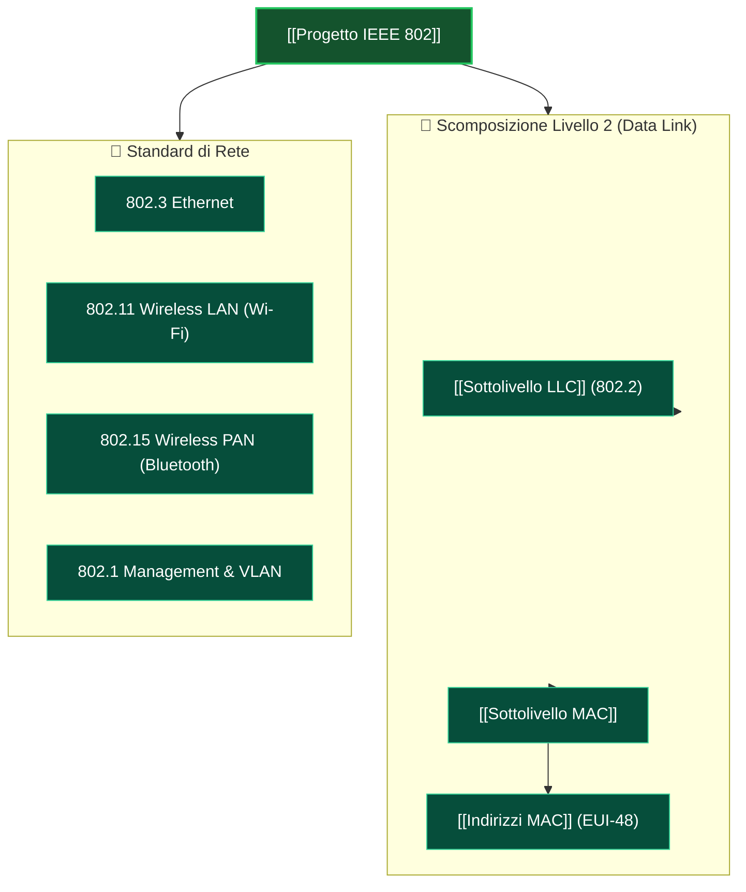

Il **progetto IEEE 802** è una famiglia di standard sviluppati dall'IEEE che definiscono i livelli Fisico (Livello 1) e Data Link (Livello 2) per reti locali ([[LAN]]), metropolitane (MAN) e personali (PAN), su pacchetti a lunghezza variabile.

### Mappa Concettuale IEEE 802:

---

### Componenti Principali:
- **802.1**: Network Management, Bridge, VLAN.
- **802.2**: Logical Link Control (LLC).
- **802.3**: Ethernet (Ethernet, Fast Ethernet 802.3u, Gigabit Ethernet 802.3z, 10G 802.3ae).
- **802.11**: Wireless LAN (Wi-Fi).
- **802.15**: Wireless PAN (Bluetooth, ZigBee).

---

### 🧭 Navigazione Gerarchica
- ⬆️ **Nodo Padre:** [[Rete]]
- ⬅️ **Passo Precedente:** [[Servizi Connessi e Non Connessi]]
- ➡️ **Passo Successivo:** [[Sottolivello MAC]]
