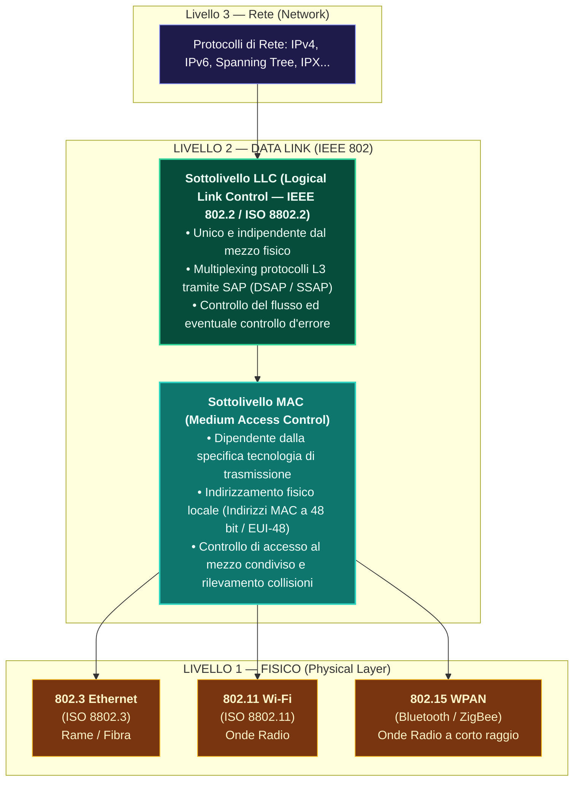
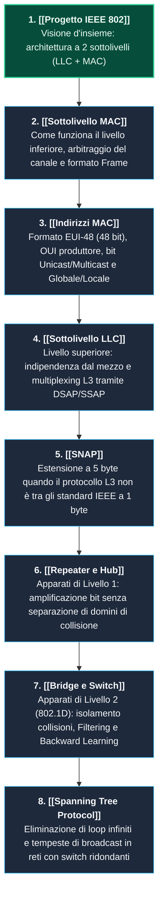

---
aliases:
  - Progetto IEEE 802
  - IEEE 802
  - Standard IEEE 802
  - Architettura IEEE 802
tags:
  - università/reti-di-calcolatori
  - ieee802
  - architettura
  - lan
date: 2026-10-06
---

# 🌐 Il Progetto IEEE 802 — Architettura delle Reti Locali

Il **Progetto IEEE 802** è la famiglia di standard internazionali sviluppati dall'IEEE (e recepiti dall'ISO come serie **ISO 8802**) che definisce l'architettura dei protocolli di **Livello 1 (Fisico)** e **Livello 2 (Data Link)** per reti locali (**[[LAN]]**), metropolitane (**MAN**) e personali (**PAN**) a **pacchetti di lunghezza variabile**.

> [!ABSTRACT] L'Assunzione di Partenza Fondamentale
> A differenza del modello geografico WAN o del protocollo IP (in cui i nodi sono separati da infiniti router intermedi), il progetto IEEE 802 parte da un'assunzione fisica ben precisa:  
> 👉 **I computer che devono comunicare si trovano fisicamente all'interno della stessa rete locale (stessa LAN).**  
> Di conseguenza, non servono algoritmi complessi di instradamento geografico a hop multipli, ma occorre risolvere due problemi specifici e locali:
> 1. **In ricezione:** capire inequivocabilmente chi sia il destinatario e chi il mittente sul mezzo locale.
> 2. **In trasmissione:** se il canale fisico è condiviso (es. onde radio o cavo coassiale), arbitrare l'accesso al mezzo ed evitare o risolvere i conflitti (collisioni).

---

## 🏗️ 1. Come è Fatto: Scomposizione del Livello 2 (Data Link)

Nel modello teorico **[[Modello ISO-OSI|ISO/OSI]]**, il Livello 2 è un unico blocco (*Data Link Layer*).  
La grande intuizione ingegneristica di **IEEE 802** è stata **spezzare il Livello 2 in due sottolivelli gerarchici distinti**:



### Perché Questa Scomposizione?
- **Indipendenza dal Mezzo (Sottolivello LLC):** Il sottolivello superiore LLC (standard **IEEE 802.2**) è **identico per tutte le tecnologie**. Fornisce al livello superiore (IP) una visione uniforme e astratta della rete, sia che sotto ci sia un cavo Ethernet in rame, una fibra ottica a $10\text{ Gbps}$ o un'antenna Wi-Fi.
- **Specializzazione Tecnologica (Sottolivello MAC):** Il sottolivello inferiore MAC si adatta alle particolarità fisiche del canale (gestione del cavo punto-punto, CSMA/CD su bus condiviso, CSMA/CA su wireless).

---

## 📦 2. Come Sono Fatti i Pacchetti: L'Imbustamento a Matrioska

La trasmissione dei dati avviene mediante un elegante meccanismo di **incapsulamento PDU nidificato**:

```tikz
\begin{tikzpicture}[scale=0.92, >=stealth, font=\sffamily]
    % Stili
    \tikzstyle{l3box} = [draw=blue!80!black, fill=blue!15, rounded corners=2pt, line width=1.2pt, minimum height=1cm, align=center]
    \tikzstyle{llcbox} = [draw=teal!80!black, fill=teal!15, rounded corners=2pt, line width=1.2pt, minimum height=1cm, align=center]
    \tikzstyle{macbox} = [draw=orange!90!black, fill=orange!20, rounded corners=2pt, line width=1.2pt, minimum height=1cm, align=center]
    \tikzstyle{fcsbox} = [draw=red!80!black, fill=red!15, rounded corners=2pt, line width=1.2pt, minimum height=1cm, align=center]

    % Livello 3 PDU
    \node[l3box, minimum width=6cm] (l3) at (0, 3) {\textbf{PDU di Livello 3 (es. Pacchetto IPv4 / IPv6)}};
    \node[left, font=\small\bfseries, color=blue!80!black] at (-3.3, 3) {Livello 3:};

    % Livello LLC PDU
    \node[left, font=\small\bfseries, color=teal!80!black] at (-5.3, 1.5) {Sottolivello LLC:};
    \node[llcbox, minimum width=1.5cm] (dsap) at (-4, 1.5) {\footnotesize\textbf{LLC-DSAP}\\ \scriptsize (1 Byte)};
    \node[llcbox, minimum width=1.5cm] (ssap) at (-2.3, 1.5) {\footnotesize\textbf{LLC-SSAP}\\ \scriptsize (1 Byte)};
    \node[llcbox, minimum width=1.5cm] (ctrl) at (-0.6, 1.5) {\footnotesize\textbf{Control}\\ \scriptsize (1-2 Byte)};
    \node[l3box, minimum width=4cm] (l3_in_llc) at (2.4, 1.5) {\footnotesize\textbf{Payload Dati (PDU L3)}};

    % Livello MAC Frame
    \node[left, font=\small\bfseries, color=orange!90!black] at (-6.8, 0) {Sottolivello MAC:};
    \node[macbox, minimum width=2.2cm] (mac_dst) at (-5.4, 0) {\footnotesize\textbf{MAC Destinatario}\\ \scriptsize (6 Byte - EUI-48)};
    \node[macbox, minimum width=2.2cm] (mac_src) at (-3.0, 0) {\footnotesize\textbf{MAC Mittente}\\ \scriptsize (6 Byte - EUI-48)};
    \node[llcbox, minimum width=6.2cm] (llc_in_mac) at (1.4, 0) {\textbf{Payload MAC (Intera LLC PDU)}};
    \node[fcsbox, minimum width=1.8cm] (fcs) at (5.6, 0) {\footnotesize\textbf{FCS (CRC)}\\ \scriptsize (4 Byte)};

    % Frecce di incapsulamento
    \draw[->, line width=1pt, dashed, color=blue!70!black] (l3.south) -- (l3_in_llc.north);
    \draw[->, line width=1pt, dashed, color=teal!70!black] (0.8, 0.9) -- (1.4, 0.6);
\end{tikzpicture}
```

### Anatomia dei Campi del Pacchetto:

| Livello | Campo | Dimensione | Significato e Funzione Ingegneristica |
|---|---|---|---|
| **MAC** | **MAC Destinatario** (*MAC-dsap*) | **6 Byte** (48 bit) | Indirizzo fisico univoco della scheda di rete ricevente (Unicast, Multicast o Broadcast). |
| **MAC** | **MAC Mittente** (*MAC-ssap*) | **6 Byte** (48 bit) | Indirizzo fisico univoco della scheda di rete trasmettente. |
| **LLC** | **LLC-DSAP** | **1 Byte** (8 bit) | *Destination Service Access Point*: specifica a quale protocollo di Livello 3 consegnare i dati sul ricevitore (es. `0x42` per STP, `0xAA` per SNAP). |
| **LLC** | **LLC-SSAP** | **1 Byte** (8 bit) | *Source Service Access Point*: specifica quale protocollo di Livello 3 ha generato il messaggio. |
| **LLC** | **Control** | **1 o 2 Byte** | Definisce il tipo di servizio LLC: non connesso (*datagram* veloce) o orientato alla connessione con numerazione di frame. |
| **L3** | **Info (Payload)** | Variabile (es. 46-1500 B) | Il vero carico utile informativo proveniente dal Livello di Rete (pacchetto IP). |
| **MAC** | **FCS** (*Frame Check Sequence*) | **4 Byte** (32 bit) | Codice di ridondanza ciclica (**CRC-32**) posto in coda per rilevare bit corrotti da disturbi sul canale. |

---

## 🎯 3. I Due Problemi Risolti dal Sottolivello MAC

Il sottolivello MAC è il "braccio operativo" di IEEE 802 sul canale fisico e deve risolvere due sfide obbligatorie:

### Problema 1: In Ricezione $\to$ Identificare Destinatario e Mittente
Poiché il canale fisico broadcast diffonde il segnale ovunque, tutte le schede collegate ricevono la forma d'onda elettrica. Il MAC risolve questo problema tramite gli **[[Indirizzi MAC]] (Standard EUI-48)**:
- **Unicast (Punto-Punto):** Comunicazione mirata a una specifica scheda di rete.
  - *Regola:* l'ultimo bit del primo byte è **`0`**. Solo la scheda con quel MAC accetta il pacchetto, tutte le altre lo scartano silenziosamente in hardware.
- **Multicast (Punto-Gruppo):** Comunicazione a un gruppo selezionato di macchine.
  - *Regola:* l'ultimo bit del primo byte è **`1`**.
- **Broadcast (A Tutti):** Comunicazione destinata a tutte le stazioni della LAN.
  - *Valore speciale:* `FF:FF:FF:FF:FF:FF` (tutti i 48 bit a 1).

### Problema 2: In Trasmissione $\to$ Arbitraggio del Canale Condiviso
Se il canale è unico e condiviso (come nell'Ethernet a cavo coassiale originario o nelle reti Wi-Fi 802.11), due trasmissioni simultanee si sovrappongono distruggendo i dati (**collisione**).
- Il MAC implementa **algoritmi distribuiti** per verificare la disponibilità del mezzo e risolvere i conflitti:
  - **CSMA/CD** (*Carrier Sense Multiple Access with Collision Detection*) per Ethernet condivisa su bus.
  - **CSMA/CA** (*Collision Avoidance*) con ACK immediato per reti wireless Wi-Fi 802.11.

---

## 🏛️ 4. La Famiglia degli Standard IEEE 802

Il progetto si articola in una serie di gruppi di lavoro specializzati:

```
IEEE 802
├── 802.1  ── Architettura generale, Network Management, Spanning Tree (802.1D), VLAN (802.1Q)
├── 802.2  ── Logical Link Control (LLC) — Standard universale comune a tutte le LAN
├── 802.3  ── Ethernet Cablata (CSMA/CD):
│             ├── 802.3u  ── Fast Ethernet (100 Mbit/s)
│             ├── 802.3z  ── Gigabit Ethernet (1000 Mbit/s)
│             ├── 802.3ae ── 10 Gigabit Ethernet (10 Gbit/s)
│             └── 802.3x  ── Flow Control (PAUSE Frame a livello MAC)
├── 802.11 ── Wireless LAN (Wi-Fi — CSMA/CA): 802.11a/b/g/n/ac/ax (Wi-Fi 6)
└── 802.15 ── Wireless PAN (Reti Personali): Bluetooth, ZigBee
```

---

## 🗺️ 5. Cosa Segue Dopo: La Roadmap Didattica del Modulo IEEE 802

Per padroneggiare l'intero modulo di esame di **IEEE 802**, gli argomenti si sviluppano secondo un filo logico propedeutico rigoroso:



1. ➡️ **[[Sottolivello MAC]]:** Analisi dettagliata di come il MAC gestisce l'accesso al mezzo e il formato della MAC PDU.
2. ➡️ **[[Indirizzi MAC]]:** Come sono strutturati i 48 bit (EUI-48), come si legge l'OUI del produttore e come distinguere indirizzi globali vs locali (virtuali).
3. ➡️ **[[Sottolivello LLC]]:** Come funziona l'indipendenza dalla tecnologia e il multiplexing tramite i Service Access Point (SAP).
4. ➡️ **[[SNAP]]:** Come trasportare protocolli di rete esterni (come il traffico IP moderno su Ethernet IEEE) mediante il protocollo SNAP a 5 byte.
5. ➡️ **[[Repeater e Hub]]:** Gli apparati fisici (L1) storici che amplificavano i bit ma creavano un unico grande dominio di collisione.
6. ➡️ **[[Bridge e Switch]]:** La rivoluzione di Livello 2: come filtrare i frame, isolare le collisioni e apprendere le posizioni degli host con il Backward Learning.
7. ➡️ **[[Spanning Tree Protocol]]:** Come evitare che i bridge ridondanti mandino in tilt la rete con tempeste di broadcast (IEEE 802.1D).

---

### 🧭 Navigazione Gerarchica

- ⬆️ **Nodo Padre:** [[Rete]]
- ⬅️ **Passo Precedente:** [[Servizi Connessi e Non Connessi]]
- ➡️ **Passo Successivo:** [[Sottolivello MAC]]
