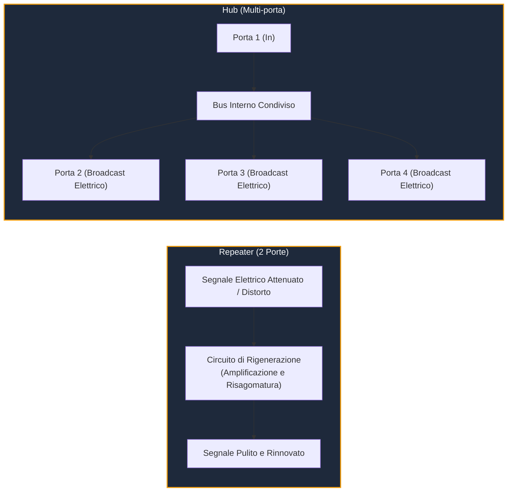

---
aliases:
  - Repeater
  - Hub
  - Ripetitore
  - Repeater e Hub
  - Concentratore
tags:
  - università/reti-di-calcolatori
  - ieee802
  - hardware
  - repeater
  - hub
date: 2026-10-06
---

# 🔁 Repeater e Hub — Gli Apparati di Livello 1 (Fisico)

Il **Repeater** (o **ripetitore**) e l'**Hub** (ripetitore multi-porta) sono dispositivi di interconnessione operanti al **Livello 1 (Fisico)** del modello ISO/OSI e del [[Progetto IEEE 802|progetto IEEE 802]].

> [!ABSTRACT] Definizione e Ruolo Architetturale
> A differenza di [[Bridge e Switch|bridge e switch]] (che operano a Livello 2 e leggono i frame), il repeater e l'hub sono **dispositivi totalmente trasparenti e privi di intelligenza**: non leggono gli [[Indirizzi MAC|indirizzi MAC]], non memorizzano pacchetti e operano direttamente a livello di **singoli bit / segnali elettrici o ottici**.  
> Il loro unico scopo è **estendere la portata geografica del cavo** superando l'attenuazione del segnale.

---

## ⚡ 1. Meccanismo di Funzionamento: Repeater vs Hub

### 1. Repeater (Ripetitore a 2 Porte)
- Riceve un segnale analogico/digitale attenuato dal passaggio sul cavo rame o fibra.
- **Pulisce, amplifica e risagoma** la forma d'onda del bit (*prevenzione del jitter e dell'attenuazione*).
- Ritrasmette immediatamente il bit sul secondo segmento con potenza nominale, con ritardo di propagazione pressoché nullo.

### 2. Hub (Ripetitore Multi-porta)
- È concettualmente un repeater dotato di molteplici porte (es. 4, 8, 16 porte RJ-45).
- Qualsiasi segnale/bit che entra da una qualsiasi porta viene **elettricamente replicato e inoltrato su tutte le altre porte contemporaneamente**.
- Crea una **topologia fisica a stella**, ma mantiene una **topologia logica a bus condiviso**.

---

## 💥 2. Il Dominio di Collisione: Il Limite Strutturale di Hub e Repeater

> [!CAUTION] Repeater e Hub NON Separano i Domini di Collisione!
> Poiché inoltrano ogni segnale elettrico indiscriminatamente su tutte le porte:
> - Tutti gli host collegati a un hub o a una catena di repeater appartengono allo **stesso identico dominio di collisione**.
> - Se due computer collegati allo stesso hub trasmettono contemporaneamente, i loro segnali si sovrappongono e collidono sul bus comune.
> - La banda totale nominale (es. $10\text{ Mbit/s}$) è **condivisa** tra tutte le stazioni collegate (più computer ci sono, minore è la banda disponibile per ciascuno).
> - Se si verifica una collisione, l'hub propaga il segnale di collisione (*jam signal*) a tutte le porte.

---

## 📊 3. Quadro Comparativo d'Esame: Repeater vs Bridge vs Switch vs Router

Questo confronto rappresenta una delle domande fondamentali dell'esame di Reti di Calcolatori:

| Caratteristica | 🔁 Repeater / Hub | 🌉 Bridge | 🔀 Switch | 🧭 Router |
|---|---|---|---|---|
| **Livello ISO/OSI** | **Livello 1** (Fisico) | **Livello 2** (Data Link) | **Livello 2** (Data Link) | **Livello 3** (Rete) |
| **Unità Dati (PDU)** | Bit (segnali elettrici/ottici) | Frame (trame L2) | Frame (trame L2) | Pacchetto (datagrammi L3) |
| **Indirizzi Ispezionati** | **Nessuno** | Indirizzi MAC (48 bit) | Indirizzi MAC (48 bit) | Indirizzi IP (32 / 128 bit) |
| **Modalità Inoltro** | Immediata bit-by-bit | Store & Forward (software) | Store & Forward / Cut-through (**ASIC**) | Store & Forward (software/HW) |
| **Funzione Filtering** | ❌ No (inoltro cieco ovunque) | ✅ Sì ([[Bridge e Switch\|Filtering Database]]) | ✅ Sì (Wire-speed hardware) | ✅ Sì (Routing Table) |
| **Separa Domini di Collisione?** | ❌ **NO** (un unico grande dominio) | ✅ **SÌ** (ogni porta è un dominio separato) | ✅ **SÌ** (ogni porta è un dominio separato) | ✅ **SÌ** |
| **Separa Domini di Broadcast?** | ❌ **NO** | ❌ **NO** (il broadcast viene inondato) | ❌ **NO** (richiede VLAN per separare) | ✅ **SÌ** (il router blocca il broadcast) |
| **Full-Duplex Supportato?** | ❌ No (solo Half-Duplex / CSMA-CD) | ✅ Sì | ✅ Sì (zero collisioni su porte dedicate) | ✅ Sì |

---

## 📜 4. Perché Sono Stati Rimpiazzati dagli Switch?

Nelle reti moderne gli hub e i repeater sono considerati **tecnologia obsoleta** (legacy):
1. **Saturazione da traffico:** Con l'aumento del volume di dati, condividere il canale tra 20 computer portava a collisioni continue e crollo dell'efficienza.
2. **Crollo dei costi degli switch ASIC:** Negli anni '90 e 2000, i chip hardware per switch sono diventati così economici da rendere gli hub non convenienti.
3. **Avvento del Full-Duplex:** Gli switch consentono trasmissioni bidirezionali simultanee a zero collisioni (*microsegmentazione*), disattivando completamente l'algoritmo CSMA/CD.

---

## 🧭 Navigazione Gerarchica

- ⬆️ **Nodo Padre:** [[Rete]]
- ⬅️ **Passo Precedente:** [[SNAP]]
- ➡️ **Passo Successivo:** [[Bridge e Switch]]
