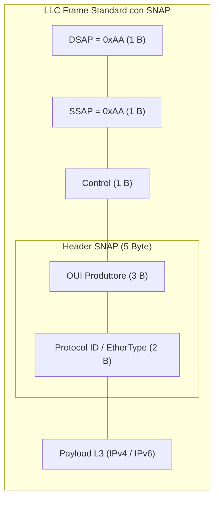

---
aliases:
  - SNAP
  - Subnetwork Access Protocol
tags:
  - università/reti-di-calcolatori
  - ieee802
date: 2026-09-29
---

# 🏷️ SNAP — Subnetwork Access Protocol

Lo **SNAP** (*Subnetwork Access Protocol*) è un'estensione dell'header [[Sottolivello LLC|LLC (IEEE 802.2)]] creata per superare il limite degli indirizzi DSAP/SSAP a 1 byte (256 valori).

> [!INFO] Meccanismo di Attivazione
> 1. Negli header LLC, i campi **`LLC-DSAP`** e **`LLC-SSAP`** vengono entrambi impostati sul valore esadecimale riservato **`0xAA`**.
> 2. Ciò segnala che la PDU trasporta un protocollo di livello 3 che **non è stato ufficialmente standardizzato** nei codici IEEE ad 1 byte.
> 3. Subito dopo il campo `Control` dell'LLC viene inserito l'header SNAP di **5 byte**:
>    - **3 Byte OUI**: *Organization Unique Identifier* dell'azienda/ente produttore.
>    - **2 Byte Protocol ID**: *EtherType* che denota lo specifico protocollo di livello 3 (es. `0x0800` per IPv4, `0x86DD` per IPv6).

---

### 🧭 Navigazione Gerarchica
- ⬆️ **Nodo Padre:** [[Rete]]
- ⬅️ **Passo Precedente:** [[Sottolivello LLC]]
- ➡️ **Passo Successivo:** [[Repeater e Hub]]
