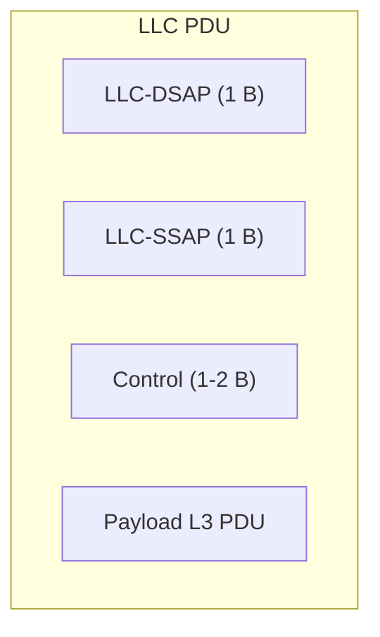
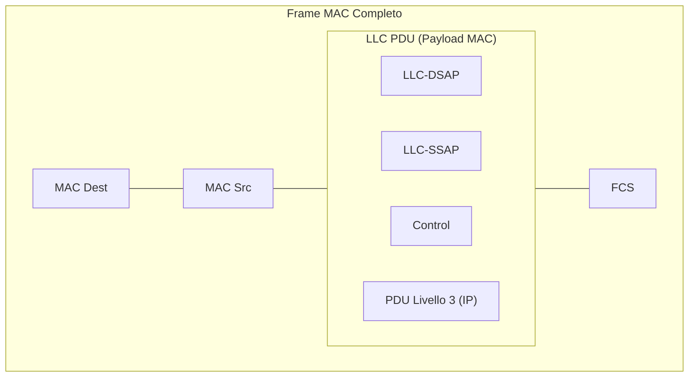

Il sottolivello **LLC** (*Logical Link Control* - IEEE 802.2) è la porzione superiore del Livello 2 nel [[Progetto IEEE 802]].

### Ruolo e Obiettivo:
- Fornisce un'interfaccia unica ed indipendente dalla tecnologia sottostante verso i protocolli di Livello 3 (Rete).
- Consente la **convivenza di diversi protocolli di livello 3** (es. IP, IPX, Spanning Tree) sulla stessa rete locale e sulla stessa macchina.

---

### Struttura della LLC PDU:

- **LLC-DSAP**: *Destination Service Access Point* (1 byte), denota il protocollo L3 destinatario.
- **LLC-SSAP**: *Source Service Access Point* (1 byte), denota il protocollo L3 mittente.
- **Control**: Definisce il tipo di pacchetto LLC (es. datagramma non connesso o flusso connesso).

---

### Estensione SNAP (Subnetwork Access Protocol):
Poiché 1 byte consente solo 256 combinazioni (assegnate dall'IEEE a protocolli ufficiali come `0x42` per 802.1D Spanning Tree o `0xF0` per NetBIOS):
- Se `LLC-DSAP` e `LLC-SSAP` assumono il valore esadecimale **`0xAA`** (SNAP):
  - Il pacchetto contiene un protocollo L3 non standard IEEE.
  - Subito dopo il campo `Control` viene aggiunto un campo **Protocol Identifier di 5 byte** (3 byte OUI + 2 byte EtherType) per identificare qualsiasi protocollo L3 proprietario o custom.

---

### Incapsulamento Completo (MAC + LLC):

---

### 🧭 Navigazione Gerarchica
- ⬆️ **Nodo Padre:** [[Rete]]
- ⬅️ **Passo Precedente:** [[Indirizzi MAC]]
- ➡️ **Passo Successivo:** [[SNAP]]
