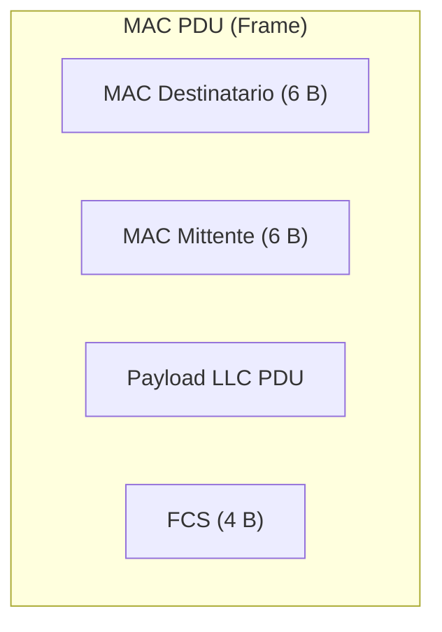

Il sottolivello **MAC** (*Medium Access Control*) è la porzione inferiore del Livello 2 nel [[Progetto IEEE 802]]. È specifico per ogni diversa tecnologia trasmissiva (Ethernet, Wi-Fi, PAN).

### Problemi Risolti dal MAC:
Assumendo che i computer siano posizionati nella stessa [[LAN]]:
1. **In Ricezione**: Identificazione univoca del destinatario (e del mittente) all'interno della rete locale.
2. **In Trasmissione**: Se la LAN condivide un unico canale fisico (es. 802.11 Wi-Fi), verifica della disponibilità del canale e gestione/risoluzione delle collisioni tramite algoritmi distribuiti.

---

### Struttura della PDU MAC:

- **Indirizzo Destinatario**: Indirizzo MAC a 6 byte.
- **Indirizzo Mittente**: Indirizzo MAC a 6 byte.
- **FCS (*Frame Check Sequence*)**: Campo di 4 byte (CRC) inserito alla fine del frame per l'identificazione degli errori trasmissivi.

---

### 🧭 Navigazione Gerarchica
- ⬆️ **Nodo Padre:** [[Rete]]
- ⬅️ **Passo Precedente:** [[Progetto IEEE 802]]
- ➡️ **Passo Successivo:** [[Indirizzi MAC]]
