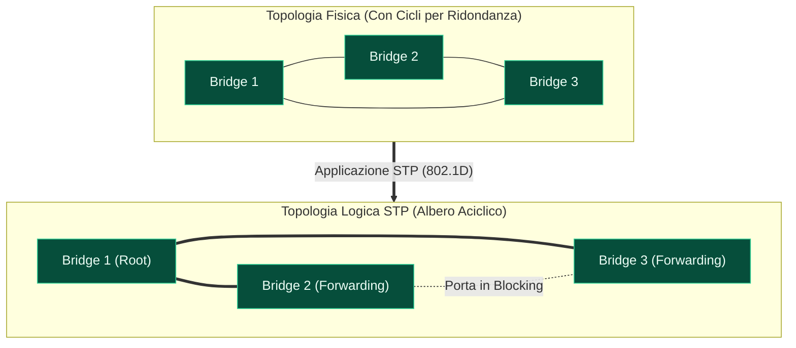
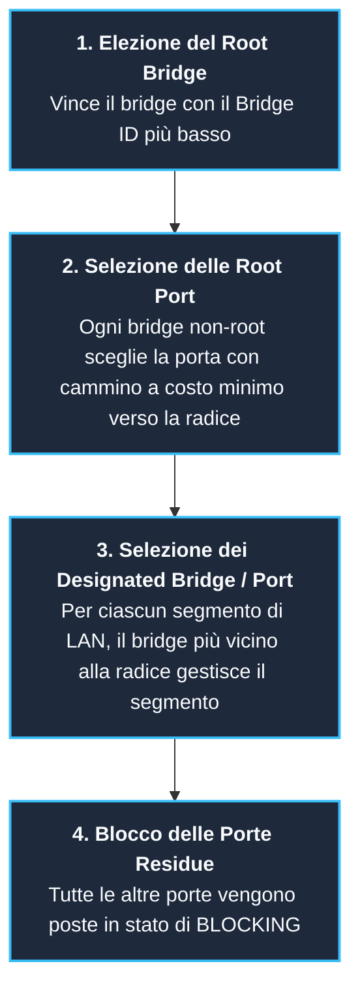

---
aliases:
  - Spanning Tree Protocol
  - STP
  - IEEE 802.1D STP
  - BPDU
  - Spanning Tree
tags:
  - università/reti-di-calcolatori
  - ieee802
  - bridge
  - stp
date: 2026-10-06
---

# 🌳 Spanning Tree Protocol (STP — IEEE 802.1D)

Lo **Spanning Tree Protocol (STP)**, standardizzato in **IEEE 802.1D**, è l'algoritmo di controllo distribuito che garantisce l'assenza di cicli (anelli chiusi) all'interno di una rete locale switched ([[Bridge e Switch|bridge/switch]]), pur mantenendo attivi collegamenti ridondanti per l'alta affidabilità.

---

## 🌪️ 1. Il Problema dei Cicli nelle Reti Locali

Nelle reti reali, i collegamenti fisici tra bridge formano quasi sempre un **grafo contenente cicli** per garantire **tolleranza ai guasti**: se un bridge o un cavo si rompe, deve esistere una via alternativa.

Tuttavia, l'algoritmo di **[[Bridge e Switch|Backward Learning]]** funziona **soltanto se la topologia logica della rete è un albero puro (priva di cicli)**!

> [!CAUTION] Cosa Succede se ci Sono Cicli in una Rete Switched?
> 1. **Tempesta di Broadcast (Broadcast Storm):** Se un host invia un frame di broadcast (o un frame con destinazione ignota che innesca il flooding), i bridge lo replicano su tutte le altre porte. Poiché nei frame di Livello 2 (Ethernet) **non esiste un campo TTL (Time to Live)** come nel protocollo IP di Livello 3, le copie del pacchetto continuano a girare in cerchio all'infinito moltiplicandosi, fino a saturare completamente la banda e mandare in blocco la rete.
> 2. **Instabilità del Filtering Database (MAC Table Flapping):** Lo stesso frame arriva al medesimo switch da porte diverse in momenti successivi. Lo switch riscrive continuamente la porta associata al MAC sorgente, impazzendo e rendendo vano il processo di learning.
> 3. **Consegna Multipla di Frame:** La stazione ricevente riceve decine o centinaia di copie identiche dello stesso messaggio.

---

## 🎯 2. L'Intuizione e l'Obiettivo dello Spanning Tree

Dato un grafo fisico arbitrario (con cicli e ridondanze), l'algoritmo calcola dinamicamente un **albero di copertura (Spanning Tree)**:
- **Tutti i dispositivi e segmenti di rete rimangono raggiungibili** (l'albero copre tutti i nodi).
- **I percorsi ciclici vengono interrotti logicamente**: solo le porte che appartengono all'albero di copertura rimangono in stato attivo di **`Forwarding`**, mentre le porte ridondanti vengono poste in stato di blocco (**`Blocking`**).
- **Ricalcolo in caso di guasto:** Se un collegamento attivo si interrompe, lo spanning tree viene ricalcolato e le porte precedentemente bloccate vengono automaticamente promosse a `Forwarding`, ripristinando la connettività senza intervento umano.

---

## 📨 3. I Messaggi del Protocollo: Le BPDU

I bridge costruiscono e mantengono lo spanning tree scambiandosi periodicamente frame speciali detti **BPDU** (*Bridge Protocol Data Unit*):

> [!INFO] Incapsulamento delle BPDU
> - **Indirizzo MAC Destinazione:** Multicast speciale riservato **`01:80:C2:00:00:00`** (tutti i bridge conformi a 802.1D ascoltano questo indirizzo e **non inoltrano mai** questo frame oltre il link).
> - **Indirizzo LLC SAP:** L'identificativo SAP per Spanning Tree nel sottolivello [[Sottolivello LLC|LLC]] è **`01000010`** (esadecimale **`0x42`**).

Le BPDU contengono informazioni cruciali per l'algoritmo:
- **Root Bridge ID:** Identificativo del bridge che si ritiene essere la radice dell'albero.
- **Root Path Cost:** Costo complessivo cumulato del cammino per raggiungere il Root Bridge.
- **Bridge ID Trasmittente:** `(Priorità numerica : Indirizzo MAC)` del bridge che invia la BPDU.
- **Port ID:** Identificativo della porta da cui esce la BPDU.

---

## ⚙️ 4. Le Fasi Operative dell'Algoritmo (IEEE 802.1D)

L'algoritmo si articola in 4 passi deterministici eseguiti in modo distribuito:

### 1. Elezione del Root Bridge (Ponte Radice)
- All'accensione, ogni bridge si autoproclama radice trasmettendo BPDU.
- Appena riceve una BPDU con un Bridge ID inferiore al proprio, accetta il mittente come radice migliore e aggiorna le proprie BPDU.
- A convergenza, il bridge con il **Bridge ID minore** (priorità più bassa, e a parità di priorità, MAC address più basso) viene universalmente riconosciuto come **Root Bridge**.

### 2. Selezione della Root Port per ciascun Bridge Non-Root
- Ogni bridge calcola il costo del cammino verso la radice sommando i costi dei link attraversati.
- La porta fisica che offre il cammino a **costo totale minimo verso il Root Bridge** viene eletta **Root Port** e posta in stato di `Forwarding`.

### 3. Selezione delle Designated Port per ciascun Segmento LAN
- Su ciascun segmento condiviso di rete (dominio di collisione), deve esistere un solo bridge incaricato di inoltrare il traffico verso la radice.
- Il bridge che offre il cammino più economico verso la radice diventa il **Designated Bridge** del segmento, e la sua porta connessa a quel segmento diventa la **Designated Port** (stato `Forwarding`).

### 4. Blocco delle Porte Non Assegnate (Alternate / Blocking)
- Tutte le porte che non sono né *Root Port* né *Designated Port* vengono poste nello stato di **`Blocking`**.
- Una porta in blocking:
  - **Non inoltra** i pacchetti dati degli utenti.
  - **Non apprende** indirizzi MAC nel Filtering Database.
  - **Continua ad ascoltare le BPDU** per monitorare la salute dei collegamenti.

---

## 🔄 5. Ricalcolo in Caso di Guasto (Fault Recovery)

Lo Spanning Tree non è statico: monitora costantemente la rete per garantire continuità di servizio:
1. Il Root Bridge genera BPDU a intervalli regolari (tipicamente ogni **2 secondi**, *Hello Time*).
2. I bridge intermedi propagano le BPDU lungo i rami dell'albero attivo.
3. Se un cavo o un bridge si rompe, le BPDU smettono di transitare sulle porte collegate.
4. Dopo la scadenza di un timer di timeout (tipicamente **20 secondi**, *Max Age*), i bridge a valle rilevano l'assenza della radice e avviano un **ricalcolo automatico dello Spanning Tree**.
5. Le porte precedentemente in `Blocking` vengono portate allo stato di `Forwarding`, ripristinando immediatamente la connettività globale.

---

## 🧭 Navigazione Gerarchica

- ⬆️ **Nodo Padre:** [[Rete]]
- ⬅️ **Passo Precedente:** [[Bridge e Switch]]
- ➡️ **Passo Successivo:** [[Kathará]]
