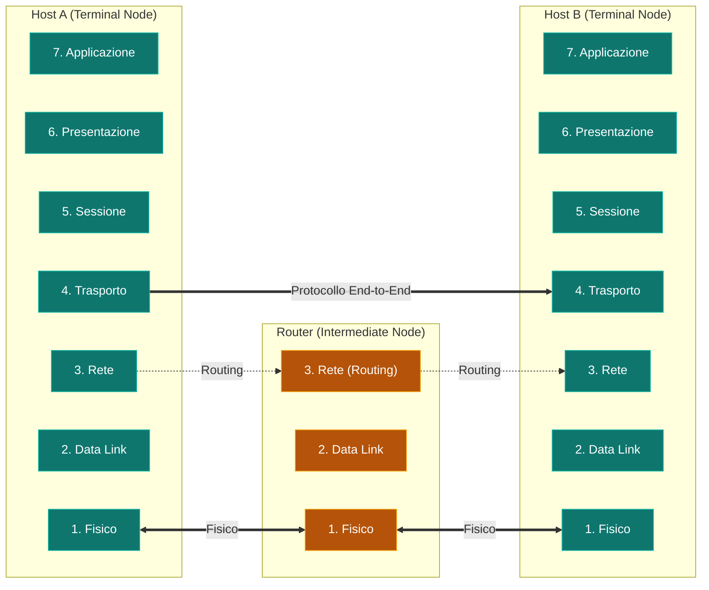

Il modello [[Modello ISO-OSI]] suddivide le funzionalità di rete in 7 livelli gerarchici.

### Classificazione nei Nodi:
- **Livelli End-to-End (4, 5, 6, 7)**: Risiedono esclusivamente nei nodi terminali (host di origine e destinazione).
- **Livelli Hop-by-Hop (1, 2, 3)**: Risiedono anche nei nodi intermedi (router e switch).

---

### Mappa dei 7 Livelli:

---

### Descrizione Sintetica dei Livelli:

1. **Fisico (1)**: Trasmissione della sequenza grezza di bit sul mezzo trasmissivo (voltaggi, frequenze).
2. **Data Link (2)**: Trasferimento di frame tra nodi adiacenti, rilevazione e correzione degli errori di trasmissione fisica.
3. **Rete (3)**: Conosce la topologia di rete; responsabile dell'**instradamento** (*routing*) e della commutazione end-to-end.
4. **Trasporto (4)**: Primo livello **End-to-End**. Colma le deficienze della rete garantendo affidabilità, controllo di flusso e gestione della connessione.
5. **Sessione (5)**: Sincronizzazione e gestione del dialogo tra due processi applicativi.
6. **Presentazione (6)**: Gestione della sintassi e codifica dei messaggi (crittografia, compressione, formati dati).
7. **Applicazione (7)**: Interfaccia di rete per le applicazioni utente (es. HTTP, FTP, SMTP).

---

### 🧭 Navigazione Gerarchica
- ⬆️ **Nodo Padre:** [[Rete]]
- ⬅️ **Passo Precedente:** [[Modello ISO-OSI]]
- ➡️ **Passo Successivo:** [[PDU e Incapsulamento]]
