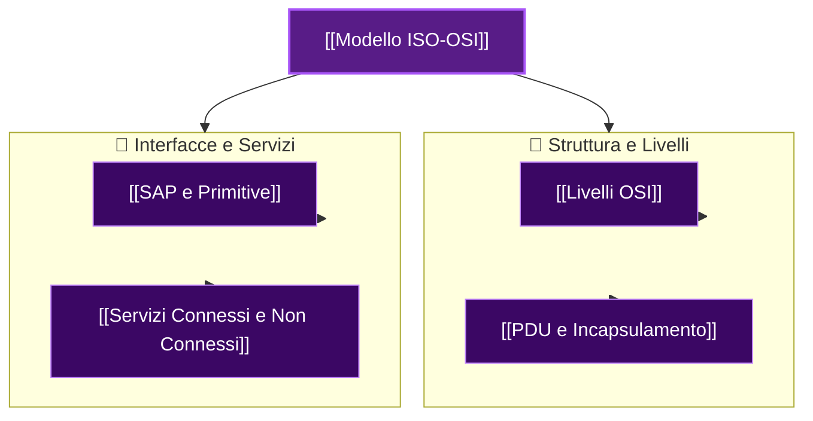

Il modello **ISO/OSI** (*International Organization for Standardization - Open Systems Interconnection*) è lo standard teorico di riferimento per l'architettura delle reti a stratificazione (7 livelli).

### Principi di Progettazione:
- **Astrazione**: Ogni strato fornisce allo strato superiore funzioni ben definite nascondendo i dettagli implementativi.
- **Minimizzazione delle interfacce**: Lo scambio di informazioni tra livelli adiacenti è ridotto al minimo indispensabile.
- **Indipendenza**: Le modifiche all'interno di uno strato non impattano gli altri, purché l'interfaccia resti inalterata.

---

### Mappa Concettuale ISO/OSI:

---

### Analogia dei Filosofi:
Per comprendere la stratificazione, si consideri due filosofi (uno in Kenya, uno in Indonesia) che comunicano tramite i rispettivi traduttori e ingegneri:
1. **Filosofi (Applicazione)**: Scambiano concetti astratti.
2. **Traduttori (Presentazione/Sessione)**: Traducono il messaggio in una lingua comune condivisa.
3. **Ingegneri (Fisico/Data Link)**: Convertono il testo in segnali (es. codice Morse) trasmessi sul canale.

---

### 🧭 Navigazione Gerarchica
- ⬆️ **Nodo Padre:** [[Rete]]
- ⬅️ **Passo Precedente:** [[Circuito Virtuale]]
- ➡️ **Passo Successivo:** [[Livelli OSI]]
