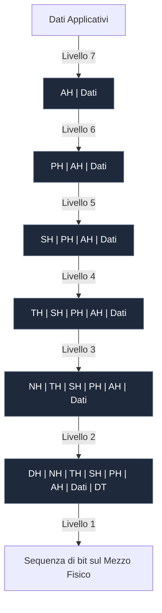

Durante il processo di trasmissione nel [[Modello ISO-OSI]], i dati generati da un livello vengono imbustati all'interno delle strutture del livello sottostante.

### Concetti Fondamentali:
- **SDU (*Service Data Unit*)**: Il payload di dati ricevuto dal livello superiore $N+1$.
- **Header ($N$-Header)**: Informazioni di controllo aggiunte dallo strato $N$.
- **PDU (*Protocol Data Unit*)**: L'unità complessiva generata dallo strato $N$ ($\text{PDU} = \text{Header} + \text{SDU}$).

$$\text{N-PDU} = \text{Header}_N + \text{Payload}_N$$

---

### Processo di Incapsulamento:

---

### Terminologia PDU nei Livelli:
- **Livello 4 (Trasporto)**: Segmento / Datagramma
- **Livello 3 (Rete)**: Pacchetto / Datagramma IP
- **Livello 2 (Data Link)**: Trama / Frame
- **Livello 1 (Fisico)**: Bit

---

### 🧭 Navigazione Gerarchica
- ⬆️ **Nodo Padre:** [[Rete]]
- ⬅️ **Passo Precedente:** [[Livelli OSI]]
- ➡️ **Passo Successivo:** [[SAP e Primitive]]
