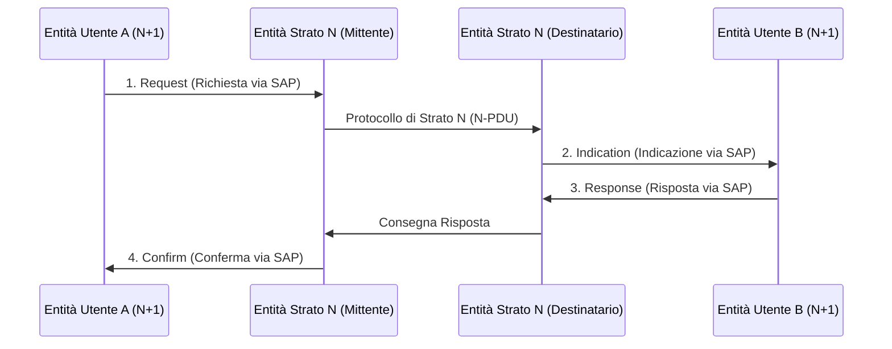

Nel [[Modello ISO-OSI]], l'interazione tra strati adiacenti e tra entità dello stesso livello avviene tramite punti di accesso logici e primitive standardizzate.

### Service Access Point (SAP):
Il **SAP** è il punto logico in cui uno strato $N$ eroga i propri servizi allo strato superiore $N+1$.
- Garantisce l'**indipendenza funzionale**: lo strato $N+1$ non deve conoscere il funzionamento interno dello strato $N$, ma solo la sua interfaccia tramite il SAP.

---

### Flusso delle Primitive di Servizio:

### Le 4 Primitive:
1. **Richiesta (*Request*)**: L'utente $N+1$ invoca l'esecuzione di un servizio dallo strato sottostante $N$.
2. **Indicazione (*Indication*)**: Lo strato $N$ notifica all'utente destinatario $N+1$ l’arrivo di una richiesta di servizio.
3. **Risposta (*Response*)**: L'utente destinatario $N+1$ fornisce la risposta al servizio richiesto.
4. **Conferma (*Confirm*)**: Lo strato $N$ notifica all'utente mittente $N+1$ l'esito della richiesta originaria.

---

### 🧭 Navigazione Gerarchica
- ⬆️ **Nodo Padre:** [[Rete]]
- ⬅️ **Passo Precedente:** [[PDU e Incapsulamento]]
- ➡️ **Passo Successivo:** [[Servizi Connessi e Non Connessi]]
