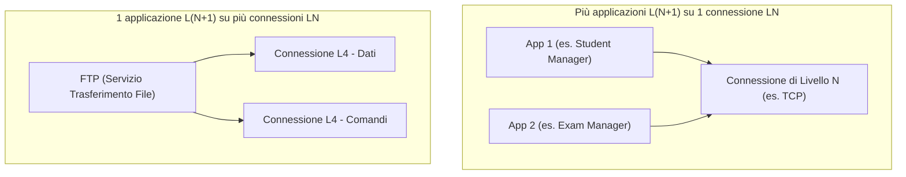

Nel [[Modello ISO-OSI]], per tutti i livelli superiori al primo sono previste due modalità operative di comunicazione.

### 1. Servizio Connesso (*Connection-Oriented*):
- **Analogia**: Telefonata.
- **Fasi**:
  1. Instaurazione della connessione (Primitive per presentarsi).
  2. Scambio di messaggi/dati ordinato.
  3. Abbattimento della connessione (Primitive per salutare e rilasciare risorse).

### 2. Servizio Non Connesso (*Connectionless*):
- **Analogia**: E-mail / Lettera postale.
- **Funzionamento**: Ciascun messaggio è inviato separatamente, contenendo l'indirizzo completo del destinatario. Nessun setup preventivo.

---

### Multiplexing tra Livelli:

---

### 🧭 Navigazione Gerarchica
- ⬆️ **Nodo Padre:** [[Rete]]
- ⬅️ **Passo Precedente:** [[SAP e Primitive]]
- ➡️ **Passo Successivo:** [[Progetto IEEE 802]]
