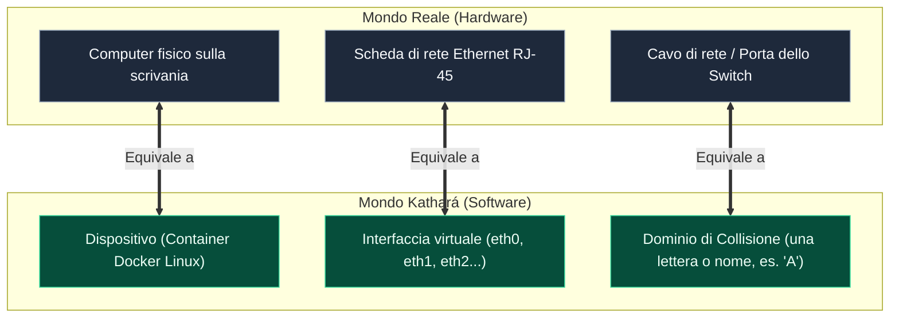
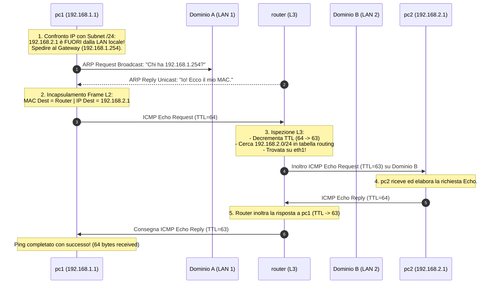

---
aliases:
  - Kathara
  - Kathará
  - Guida Kathara
  - Laboratorio Kathara
tags:
  - università/reti-di-calcolatori
  - reti
  - laboratorio
  - kathara
date: 2026-10-06
---

# 🧪 Guida Pratica e Fondamentale a Kathará

> [!ABSTRACT] 💡 Cos'è Kathará in Parole Semplici?
> **Kathará** è uno strumento software per l'**emulazione di reti di calcolatori**.  
> Invece di dover acquistare e collegare fisicamente decine di computer, switch, router e cavi Ethernet (oppure appesantire il computer con decine di lente macchine virtuali), Kathará crea **una rete virtuale completa dentro il tuo PC in pochi secondi**, sfruttando la leggerezza dei container **Docker**.  
> Ogni PC o router della rete è un container Linux indipendente, e i cavi di collegamento sono canali virtuali isolati.

---

## 🔌 1. L'Intuizione Fisica: La Metafora dei Cavi e delle Scatole

Per capire Kathará, basta visualizzare come si costruisce una rete reale in un laboratorio universitario:



> [!INFO] Il Concetto Chiave: Il "Dominio di Collisione" (Collision Domain)
> In Kathará, un **cavo virtuale** o uno **switch virtuale** è identificato semplicemente da una **lettera o stringa** (es. `"A"`, `"B"`, `"LAN1"`).  
> Se colleghi l'interfaccia `eth0` del computer `pc1` alla lettera `"A"`, e colleghi l'interfaccia `eth0` del `router` alla stessa lettera `"A"`, è esattamente come se avessi inserito un cavo di rete tra le due macchine: **possono parlarsi a Livello 2 (Data Link)**!

---

## 📁 2. L'Anatomia di un Laboratorio Kathará

Un laboratorio Kathará non è un programma complicato: è semplicemente **una cartella** sul tuo computer contenente normalissimi file di testo.

```
📁 MioLaboratorio/
├── 📄 lab.conf             <-- IL PROGETTO DEL CABLAGGIO (Chi è collegato a cosa)
├── 📄 pc1.startup          <-- TASTO D'ACCENSIONE DI PC1 (Cosa fa appena si avvia)
├── 📄 router.startup       <-- TASTO D'ACCENSIONE DEL ROUTER
├── 📄 pc2.startup          <-- TASTO D'ACCENSIONE DI PC2
└── 📁 pc1/                 <-- (Opzionale) File da iniettare nel filesystem di pc1
```

### I File Spiegati nel Dettaglio:

1. **`lab.conf` (La mappa dei collegamenti):**  
   È il file principale. Dice a Kathará quali macchine creare e a quali cavi (domini) collegare le loro schede di rete.  
   **Sintassi:**
   ```ini
   nome_dispositivo[numero_interfaccia]="lettera_dominio"
   ```
   *Esempio:*
   - `pc1[0]="A"` $\to$ l'interfaccia `eth0` di `pc1` è collegata al dominio `A`.
   - `router[0]="A"` $\to$ l'interfaccia `eth0` del `router` è collegata al dominio `A`.
   - `router[1]="B"` $\to$ l'interfaccia `eth1` del `router` è collegata al dominio `B`.

2. **I file `<dispositivo>.startup` (Gli script di avvio):**  
   Sono normali script Bash eseguiti automaticamente dal dispositivo nel momento esatto in cui si accende. Qui dentro si scrivono i comandi per:
   - Assegnare gli indirizzi IP alle schede di rete (`ip address add ...`).
   - Accendere le schede di rete (`ip link set ... up`).
   - Impostare le rotte o il default gateway (`ip route add ...`).
   - Abilitare l'inoltro dei pacchetti se il dispositivo è un router (`sysctl -w net.ipv4.ip_forward=1`).

3. **La cartella `<dispositivo>/` (Filesystem injection, opzionale):**  
   Se crei una sottocartella con lo stesso nome di una macchina (es. una cartella chiamata `pc1/`), qualsiasi file o cartella metti al suo interno verrà copiato nella radice `/` di quella macchina virtuale.  
   *Esempio:* `pc1/etc/resolv.conf` andrà a sovrascrivere `/etc/resolv.conf` dentro `pc1`.

---

## 🕹️ 3. I Comandi Kathará da Terminale (Il Telecomando)

Per gestire il laboratorio, apri un terminale nella cartella del progetto ed esegui:

| Comando Kathará | Cosa Fa nel Mondo Reale? | Quando si Usa? |
|---|---|---|
| `kathara lstart` | **Accende la rete:** crea i container, stende i cavi ed esegue gli script `.startup`. Apre una finestra di terminale per ogni macchina. | All'inizio del laboratorio per iniziare a lavorare. |
| `kathara lstart --noterminals` | Accende la rete in background **senza aprire finestre grafiche** (utilissimo se vuoi lavorare da un solo terminale). | Quando non vuoi 10 finestre aperte sullo schermo. |
| `kathara lclean` | **Spegne tutto e smonta il banco:** distrugge i container e i domini di collisione, liberando completamente la RAM. | Quando hai finito o vuoi ripartire da zero. |
| `kathara lrestart` | Esegue un `lclean` seguito immediatamente da un `lstart`. | Per riapplicare modifiche ai file `.startup` o a `lab.conf`. |
| `kathara connect <nome>` | **Riapre il terminale:** se per sbaglio chiudi la finestra di una macchina (es. `pc1`), questo comando riapre una shell dentro di essa. | Quando hai chiuso una finestra per errore. |
| `kathara exec <nome> -- <cmd>` | Esegue un singolo comando dentro una macchina senza aprirne la shell. | Per test rapidi (es. `kathara exec pc1 -- ping -c 2 1.2.3.4`). |
| `kathara wipe -f` | **Il tasto di emergenza:** pulizia forzata di tutti i container e processi Kathará orfani rimasti bloccati in memoria. | Se Docker si blocca o Kathará segnala errori strani. |

---

## 🧰 4. La Cassetta degli Attrezzi: I Comandi di Rete Linux

Una volta dentro una macchina virtuale Kathará (o dentro i file `.startup`), utilizzi i comandi standard di amministrazione di rete Linux della suite `iproute2`.

### 1. Configurazione Indirizzo IP e Maschera
```bash
ip address add 192.168.1.1/24 dev eth0
```
- `ip address add`: comando per assegnare un IP.
- `192.168.1.1/24`: indirizzo IP in notazione CIDR (`/24` equivale a subnet mask $255.255.255.0$).
- `dev eth0`: specifica su quale interfaccia di rete applicarlo.

### 2. Accensione dell'Interfaccia di Rete
```bash
ip link set eth0 up
```
- In Linux, un'interfaccia appena creata è spesso spenta (`DOWN`).
- Questo comando equivale ad "attaccare il cavo e dare corrente": l'interfaccia passa allo stato `UP`.

### 3. Impostazione del Default Gateway (La via di uscita)
```bash
ip route add default via 192.168.1.254
```
- Dice al computer: *"Se devi spedire un pacchetto a un indirizzo IP che non appartiene alla tua sottorete locale, spediscilo al router $192.168.1.254$"*.

### 4. Trasformare Linux in un Router (FONDAMENTALE!)
```bash
sysctl -w net.ipv4.ip_forward=1
```
> [!IMPORTANT] Perché Questo Comando è Obbligatorio sui Router?
> Di default, per motivi di sicurezza, qualsiasi sistema operativo Linux opera come **Host Finale**: se riceve un pacchetto IP il cui indirizzo di destinazione non è uno dei suoi, **lo distrugge immediatamente**.  
> Impostando `net.ipv4.ip_forward=1`, istruisci il kernel Linux a fare il suo mestiere di **Router**: prendere il pacchetto da un'interfaccia, consultare la tabella di instradamento e inoltrarlo sull'altra interfaccia!

### 5. Comandi di Diagnostica e Collaudo
- `ip address show` (o `ip a`): mostra tutti gli IP assegnati alle interfacce e il loro stato (`UP` o `DOWN`).
- `ip route show` (o `ip r`): mostra la tabella di instradamento (le rotte note alla macchina).
- `ping <IP_DESTINAZIONE>`: invia pacchetti ICMP Echo Request per verificare la raggiungibilità di Livello 3.
- `traceroute -n <IP_DESTINAZIONE>`: mostra la sequenza esatta di tutti i router attraversati per giungere a destinazione.
- `tcpdump -i eth0 -n`: ascolta e stampa a video tutti i pacchetti che transitano su `eth0` in tempo reale (un vero analizzatore di protocolli da terminale).

---

## 🏗️ 5. Progetto Guidato Completo: Due Host e un Router

Analizziamo l'architettura classica presente nella cartella di laboratorio `Reti di Calcolatori/Kathara/Project1`.

### Schema Architetturale della Topologia:

```tikz
\begin{tikzpicture}[scale=0.9, >=stealth, font=\sffamily]
    % Stili
    \tikzstyle{host} = [draw=teal!80!black, fill=teal!10, rounded corners=4pt, line width=1.5pt, minimum width=2.6cm, minimum height=1.3cm, align=center]
    \tikzstyle{router} = [draw=blue!80!black, fill=blue!10, rounded corners=4pt, line width=1.5pt, minimum width=3.4cm, minimum height=1.6cm, align=center]
    \tikzstyle{busA} = [line width=3pt, draw=orange!85!black]
    \tikzstyle{busB} = [line width=3pt, draw=cyan!85!black]
    \tikzstyle{wire} = [line width=1.2pt, draw=gray!80!black]
    \tikzstyle{port} = [font=\footnotesize\ttfamily, color=black!80]

    % Dominio A (Bus arancione)
    \draw[busA] (-5.5, 0) -- (-1, 0);
    \node[above, font=\small\bfseries, color=orange!90!black] at (-3.2, 0.15) {Dominio "A" (LAN 1: 192.168.1.0/24)};

    % Dominio B (Bus ciano)
    \draw[busB] (1, 0) -- (5.5, 0);
    \node[above, font=\small\bfseries, color=cyan!90!black] at (3.2, 0.15) {Dominio "B" (LAN 2: 192.168.2.0/24)};

    % Dispositivi
    \node[host] (pc1) at (-3.2, -2.2) {\textbf{pc1}\\ \footnotesize 192.168.1.1/24\\ \scriptsize (GW: 192.168.1.254)};
    \node[router] (router) at (0, 2.2) {\textbf{router}\\ \footnotesize eth0: 192.168.1.254/24\\ \footnotesize eth1: 192.168.2.254/24};
    \node[host] (pc2) at (3.2, -2.2) {\textbf{pc2}\\ \footnotesize 192.168.2.1/24\\ \scriptsize (GW: 192.168.2.254)};

    % Cavi di collegamento
    \draw[wire] (pc1.north) -- (-3.2, 0) node[pos=0.4, right, port] {eth0};
    \draw[wire] (-1.3, 1.4) -- (-1.3, 0) node[pos=0.4, left, port] {eth0};
    \draw[wire] (1.3, 1.4) -- (1.3, 0) node[pos=0.4, right, port] {eth1};
    \draw[wire] (pc2.north) -- (3.2, 0) node[pos=0.4, right, port] {eth0};
\end{tikzpicture}
```

---

### I 4 File di Configurazione:

#### 1. `lab.conf`
Definisce la topologia: `pc1` e l'interfaccia 0 del router sono sul dominio `A`; `pc2` e l'interfaccia 1 del router sono sul dominio `B`.
```ini
LAB_DESCRIPTION="Laboratorio introduttivo Kathara: Due PC e un Router"
LAB_VERSION=1.0
LAB_AUTHOR="Reti di Calcolatori"

# pc1 è collegato al dominio di collisione A (LAN 1)
pc1[0]="A"

# router ha due interfacce: eth0 sul dominio A e eth1 sul dominio B
router[0]="A"
router[1]="B"

# pc2 è collegato al dominio di collisione B (LAN 2)
pc2[0]="B"
```

#### 2. `pc1.startup`
Assegna l'IP a `pc1`, alza la scheda e imposta il router come gateway.
```bash
#!/bin/bash
ip address add 192.168.1.1/24 dev eth0
ip link set eth0 up
ip route add default via 192.168.1.254
```

#### 3. `router.startup`
Configura entrambe le interfacce e abilita l'inoltro dei pacchetti IP.
```bash
#!/bin/bash
# Configurazione interfaccia verso LAN 1 (Dominio A)
ip address add 192.168.1.254/24 dev eth0
ip link set eth0 up

# Configurazione interfaccia verso LAN 2 (Dominio B)
ip address add 192.168.2.254/24 dev eth1
ip link set eth1 up

# Abilitazione inoltro pacchetti (Routing IP)
sysctl -w net.ipv4.ip_forward=1
```

#### 4. `pc2.startup`
Assegna l'IP a `pc2`, alza la scheda e imposta il router come gateway.
```bash
#!/bin/bash
ip address add 192.168.2.1/24 dev eth0
ip link set eth0 up
ip route add default via 192.168.2.254
```

---

## 🔄 6. Il Viaggio del Pacchetto: Cosa Succede Durante il Ping?

Cosa accade fisicamente a livello ISO/OSI quando esegui `ping 192.168.2.1` dalla macchina `pc1`?



1. **Verifica della Sottorete (Livello 3):**  
   `pc1` fa l'operazione di AND binario tra l'IP di destinazione ($192.168.2.1$) e la propria maschera ($255.255.255.0$).  
   Risultato: la destinazione ($192.168.2.0$) è diversa dalla propria rete locale ($192.168.1.0$). Il pacchetto non può essere inviato direttamente: **deve passare per il Default Gateway** ($192.168.1.254$).
2. **Risoluzione [[Indirizzi MAC|ARP]] (Livello 2):**  
   `pc1` ha bisogno del MAC address del router. Manda una richiesta ARP broadcast sul dominio `A`. Il router risponde con il proprio MAC.
3. **Instradamento e Decremento TTL (Router):**  
   Il router riceve il frame Ethernet, estrae il pacchetto IP, decrementa il campo **Time To Live (TTL)** da $64$ a $63$ (per prevenire loop infiniti) e consulta la propria tabella di routing: la rete $192.168.2.0/24$ è direttamente connessa su `eth1`.
4. **Consegna e Risposta:**  
   Il router invia il pacchetto a `pc2` sul dominio `B`. `pc2` risponde con un messaggio di `ICMP Echo Reply` compiendo a ritroso gli stessi passaggi.

---

## ⚠️ 7. I 5 Errori Più Comuni degli Studenti (Troubleshooting)

> [!CAUTION] 1. Dimenticare di alzare l'interfaccia (`ip link set ethX up`)
> **Sintomo:** L'IP è configurato correttamente ma non si riceve alcun pacchetto.  
> **Causa:** Senza il comando `up`, l'interfaccia rimane in stato `NO-CARRIER` o `DOWN`.  
> **Rimedio:** Aggiungi sempre `ip link set ethX up` per ogni scheda configurata.

> [!CAUTION] 2. Dimenticare l'IP Forwarding sul Router
> **Sintomo:** `pc1` riesce a fare il ping verso l'interfaccia locale del router ($192.168.1.254$), ma non raggiunge mai `pc2` ($192.168.2.1$).  
> **Causa:** Il router riceve il pacchetto su `eth0`, ma non essendo autorizzato a inoltrarlo, lo scarta silenciosamente!  
> **Rimedio:** Inserire `sysctl -w net.ipv4.ip_forward=1` nello script `.startup` del router.

> [!WARNING] 3. Dimenticare il Default Gateway sui PC Client
> **Sintomo:** Il ping dà errore `Network is unreachable`.  
> **Causa:** Il PC riceve una destinazione sconosciuta e non ha un gateway a cui chiedere aiuto.  
> **Rimedio:** Configura `ip route add default via <IP_DEL_ROUTER>`.

> [!TIP] 4. Discrepanze tra Maiuscole e Minuscole nei Domini
> In `lab.conf`, i nomi dei domini di collisione sono **case-sensitive**: `pc1[0]="A"` e `router[0]="a"` sono collegati a due cavi diversi! Assicurati di usare sempre lettere o nomi identici.

> [!TIP] 5. Terminale chiuso per sbaglio durante l'esame
> Se chiudi involontariamente la finestra del terminale di una macchina virtuale, non riavviare tutto il laboratorio: basta aprire un terminale nella cartella del progetto e digitare `kathara connect <nome_macchina>`!

---

### 🧭 Navigazione Gerarchica
- ⬆️ **Nodo Padre:** [[Rete]]
- ➡️ **Passo Successivo:** [[LAN]]
