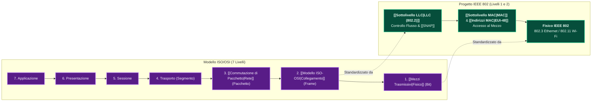
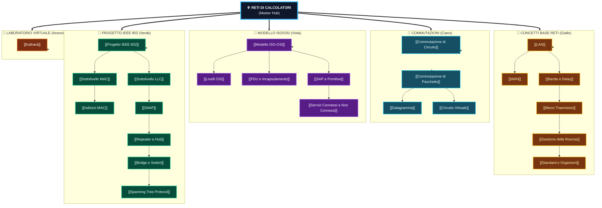

---
aliases:
  - Rete
  - Reti di Calcolatori
  - Master Hub Reti
tags:
  - università/reti-di-calcolatori
  - hub
date: 2026-10-01
---

# 🌐 Reti di Calcolatori — Master Hub

> [!ABSTRACT] 📌 File Principale & Master Hub del Corso
> Questa nota rappresenta il **File Principale** del corso di **Reti di Calcolatori**.  
> Funge da guida sintetica per l'esame: per ciascun tema trovi il **concetto fondamentale**, la **formula di ritardo o standard** e il link diretto alla relativa nota di dettaglio.

Interconnessione di risorse di calcolo autonome per scambiare informazioni e condividere risorse, con trasmissione seriale dei dati.

---

## 🏗️ 1. Architettura a Livelli: ISO/OSI vs Standard IEEE 802

I sistemi di telecomunicazione operano a strati gerarchici, ciascuno con una specifica unità dati (**PDU**):

---

## 📋 2. Quadro Sinottico: Cosa C'è da Sapere per Ogni Argomento

| Modulo | Argomento & Nota | 🎯 Concetto Chiave da Sapere | 📌 Formula / Standard Chiave | 💡 Significato Ingegneristico |
|---|---|---|---|---|
| **Reti** | **[[LAN]]** | Rete locale confinata a un edificio ($d < 5\text{ km}$); banda alta, delay basso. | $10\text{ Mbps} \div 100\text{ Gbps}$ | Basso tasso di errore, controllo totale dell'infrastruttura. |
| **Reti** | **[[WAN]]** | Rete geografica su scala globale; interconnette LAN tramite router e ISP. | Scala continentale/mondiale | Ritardi elevati, canali condivisi, necessità di instradamento complesso. |
| **Reti** | **[[Banda e Delay]]** | Differenza tra capacità del canale ($R$) e ritardo di propagazione ($T_{prop}$). | $T_{tot} = \frac{L}{R} + \frac{d}{v}$ | Banda = larghezza della strada; Delay = velocità limite della luce nel mezzo. |
| **Reti** | **[[Mezzi Trasmissivi]]** | Supporti fisici: doppino in rame (UTP/STP), fibra ottica (monomodale/multimodale), wireless. | Velocità $v \approx 2 \cdot 10^8\text{ m/s}$ | Fibra = altissima banda e immunità elettromagnetica; rame = economico. |
| **Reti** | **[[Gestione delle Risorse]]** | Multiplexing FDM (frequenza), TDM (tempo statica), Statistico (a pacchetti). | Multiplazione Statistica | La multiplazione a pacchetti massimizza l'efficienza sui picchi di traffico. |
| **Reti** | **[[Standard e Organismi]]** | Standard de jure (ISO, IEEE, ITU-T) vs de facto (IETF RFC di Internet). | Standard aperti | Permettono l'interoperabilità tra apparati di costruttori diversi. |
| **Comm** | **[[Commutazione di Circuito]]** | Riserva dedicata di risorse (canale continuo) per l'intera durata della sessione. | Fasi: Setup $\to$ Dati $\to$ Teardown | Zero ritardo di accodamento durante la chiamata, ma spreco di banda se inattivi. |
| **Comm** | **[[Commutazione di Pacchetto]]** | I dati sono spezzati in pacchetti con header instradati nodo per nodo (*Store and Forward*). | Multiplazione Statistica | Massima efficienza del canale, ma introduce ritardi di accodamento variabili (jitter). |
| **Comm** | **[[Datagramma]]** | Pacchetti indipendenti e non connessi; ogni pacchetto contiene IP sorgente e destinazione. | Instradamento dinamico (*Connectionless*) | I pacchetti possono seguire strade diverse e arrivare disordinati. |
| **Comm** | **[[Circuito Virtuale]]** | Connessione logica stabilita prima del trasferimento (header con VCI numerico breve). | Connesso con instradamento fisso | Pacchetti sempre ordinati; instradamento calcolato solo al setup. |
| **OSI** | **[[Modello ISO-OSI]]** | Architettura teorica di riferimento a 7 livelli indipendenti con interfacce SAP. | 7 Strati Logici | Ogni livello fornisce servizi al livello superiore nascondendo i dettagli. |
| **OSI** | **[[Livelli OSI]]** | Dettaglio dei singoli compiti da Livello 1 (Fisico) a Livello 7 (Applicazione). | Fisico, Data Link, Rete, Trasporto... | Separazione delle responsabilità architetturali. |
| **OSI** | **[[PDU e Incapsulamento]]** | Ogni livello incapsula la PDU superiore aggiungendo il proprio Header: $PDU = PCI + SDU$. | Frame $\supset$ Pacchetto $\supset$ Segmento | Meccanismo a matrioska alla base della trasmissione dati. |
| **OSI** | **[[SAP e Primitive]]** | Punti di accesso al servizio (SAP); 4 primitive: Request, Indication, Response, Confirm. | Chiamate di servizio tra livelli | Interfaccia formale tra strati adiacenti sullo stesso host. |
| **OSI** | **[[Servizi Connessi e Non Connessi]]** | Connessi (affidabili con handshake e ACK) vs Non Connessi (*Best Effort* veloce). | TCP (connesso) vs UDP (non conn.) | Trade-off fondamentale tra affidabilità e latenza. |
| **802** | **[[Progetto IEEE 802]]** | Standardizzazione della LAN; suddivide il Livello 2 OSI in due sottolivelli: MAC e LLC. | Famiglia 802.x | Ethernet cablata (802.3), Wi-Fi wireless (802.11). |
| **802** | **[[Sottolivello MAC]]** | Controllo di accesso al mezzo fisico condiviso (CSMA/CD per Ethernet, CSMA/CA per Wi-Fi). | Arbitraggio collisioni | Decide chi può trasmettere sul canale comune e quando. |
| **802** | **[[Indirizzi MAC]]** | Indirizzo fisico univoco a 48 bit (EUI-48); prime 3 coppie esadecimali = OUI costruttore. | `XX:XX:XX:YY:YY:YY` (6 Byte) | Indirizzamento a livello locale per recapitare i frame allo switch. |
| **802** | **[[Sottolivello LLC]]** | LLC (IEEE 802.2): indipendenza dal mezzo trasmissivo, controllo d'errore e multiplazione. | Servizi LLC tipo 1, 2, 3 | Fornisce al livello IP un'interfaccia uniforme indipendentemente da rame o fibra. |
| **802** | **[[SNAP]]** | Estensione dell'header LLC per supportare identificatori di protocollo EtherType a 16 bit. | Header SNAP (5 Byte) | Permette il trasporto di protocolli IP legacy sopra frame IEEE 802. |
| **802** | **[[Repeater e Hub]]** | Apparati L1 (Fisico); rigenerazione bit e segnali elettrici; non separano i domini di collisione. | Livello 1 Fisico | Estende la distanza fisica del cavo senza alcuna intelligenza o filtraggio MAC. |
| **802** | **[[Bridge e Switch]]** | Interconnessione L2 (MAC); Filtering, Store & Forward, Backward Learning, Full Speed (14.880 pps), Pause Frame 802.3x. | IEEE 802.1D, 802.3x | Segmenta la LAN eliminando collisioni ed instradando frame in modo trasparente. |
| **802** | **[[Spanning Tree Protocol]]** | Protocollo distributed per eliminare cicli e tempeste di broadcast su LAN con topologie ridondanti. | BPDU (`01:80:C2:00:00:00`), IEEE 802.1D | Mantiene collegamenti di backup attivi commutando su guasto in modo aciclico. |
| **Lab** | **[[Kathará]]** | Emulatore di rete virtuale basato su container Docker; configurazione apparati, routing IP e test. | `lab.conf`, `iproute2` | Laboratorio virtuale per emulare LAN, router e protocolli senza hardware fisico. |

---

## 🌳 3. Mappa Concettuale Ramificata ad Albero Puro

