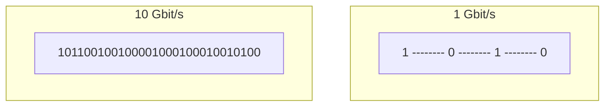

---
aliases:
  - Banda e Delay
  - Velocità di Rete
tags:
  - università/reti-di-calcolatori
  - velocità
date: 2026-09-29
---

# ⚡ Velocità in Rete: Banda vs Ritardo (Delay)

Nel linguaggio comune il termine "velocità" è ambiguo. In ingegneria delle reti occorre scindere due concetti fisici nettamente distinti: **Ritardo (Delay)** e **Larghezza di Banda (Bandwidth)**.

---

### 1. Ritardo di Propagazione (*Propagation Delay*)
È il tempo impiegato da un singolo bit per percorrere la distanza $d$ tra sorgente e destinazione.

$$\text{Delay} = \frac{d}{v}$$

- $d$: Distanza fisica in metri.
- $v$: Velocità di propagazione del segnale nel mezzo fisico ($v \approx 2 \cdot 10^8 \text{ m/s}$ in fibra/rame, $c \approx 3 \cdot 10^8 \text{ m/s}$ nello spazio libero).

> [!QUESTION] Quesito Tipico d'Esame
> *Consideriamo due trasmissioni sullo stesso cavo da Roma a Tokyo: una a 1 Gbit/s ed una a 10 Gbit/s. Quale bit arriva prima a destinazione?*  
> **Risposta**: Arrivano **nello stesso identico momento**! Il ritardo del singolo bit dipende unicamente dalla distanza $d$ e dalla velocità della luce $v$.

---

### 2. Larghezza di Banda (*Bandwidth*)
È la quantità di dati (bit) immessi nel canale trasmissivo nell'unità di tempo ($\text{bit/s}$).
- A $1\text{ Gbit/s}$, i bit sono distanziati nel tempo.
- A $10\text{ Gbit/s}$, i bit sono impacchettati in modo molto più denso nel tempo.

> [!TIP] Assioma Fondamentale
> *"Si può comprare più banda in modo relativamente facile (aggiungendo canali o elevando la frequenza), ma è difficilissimo/impossibile comprare meno delay."*

---

### 🧭 Navigazione Gerarchica
- ⬆️ **Nodo Padre:** [[Rete]]
- ⬅️ **Passo Precedente:** [[WAN]]
- ➡️ **Passo Successivo:** [[Mezzi Trasmissivi]]
