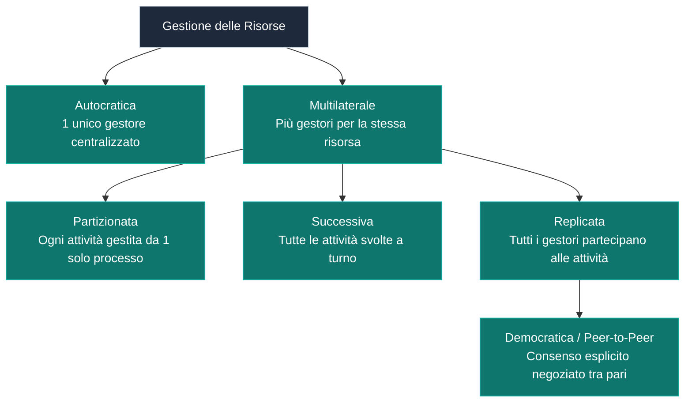

---
aliases:
  - Gestione delle Risorse
tags:
  - università/reti-di-calcolatori
  - sistemi
date: 2026-09-29
---

# ⚙️ Gestione delle Risorse e Tolleranza ai Guasti

Una rete di calcolatori può essere modellata come un insieme di risorse interconnesse (host, storage, stampanti, switch, router).

### Attività di Controllo:
1. **Verifica dei diritti di accesso**.
2. **Sequenziamento delle operazioni**.
3. **Esecuzione delle operazioni disponibili**.

---

### Modalità di Gestione:

> [!IMPORTANT] Resilienza ai Guasti (*Fault Tolerance*)
> - La resistenza ai guasti è **elevata** se è alto il numero di gestori che partecipano ad ogni attività con uguaglianza nelle responsabilità (gestione democratica/replicata).
> - Nei sistemi distribuiti è diffuso l'uso di **meccanismi elettorali** per la designazione dinamica del coordinatore/gestore.

---

### 🧭 Navigazione Gerarchica
- ⬆️ **Nodo Padre:** [[Rete]]
- ⬅️ **Passo Precedente:** [[Mezzi Trasmissivi]]
- ➡️ **Passo Successivo:** [[Standard e Organismi]]
