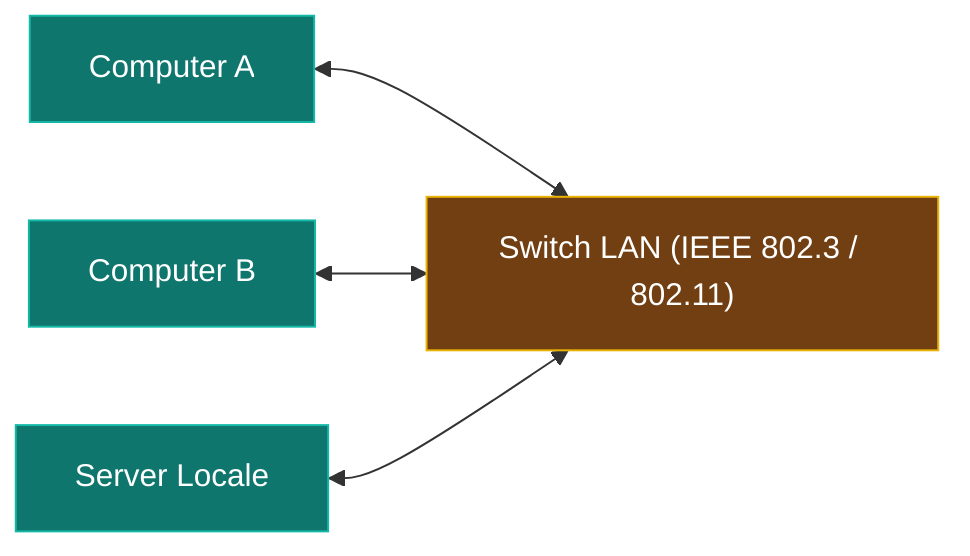

---
aliases:
  - LAN
  - Local Area Network
tags:
  - università/reti-di-calcolatori
  - reti
date: 2026-09-29
---

# 🏠 LAN — Local Area Network

La **LAN** (*Local Area Network* o Rete Locale) interconnette risorse di calcolo situate nello stesso edificio o in edifici vicini.

> [!INFO] Caratteristiche Principali
> - **Distanza geografica**: $d < 5\text{ km}$
> - **Larghezza di banda tipica**: da $10\text{ Mbit/s}$ a $100\text{ Gbit/s}$
> - **Ritardo (Delay)**: Molto basso (distanze contenute)
> - **Tasso di errore**: Molto basso rispetto alle reti geografiche

---

### Tecnologia di Riferimento:
Le reti LAN sono standardizzate principalmente dal **[[Progetto IEEE 802]]**:
- **Ethernet (IEEE 802.3)** per le reti cablate.
- **Wi-Fi (IEEE 802.11)** per le reti wireless.

---

### 🧭 Navigazione Gerarchica
- ⬆️ **Nodo Padre:** [[Rete]]
- ➡️ **Passo Successivo:** [[WAN]]
