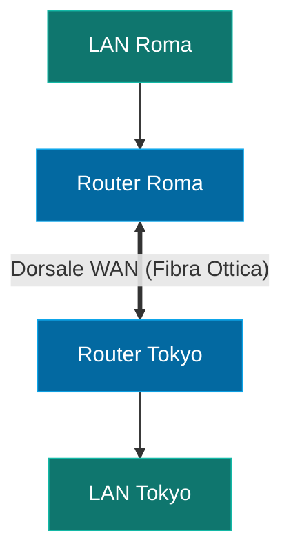

---
aliases:
  - WAN
  - Wide Area Network
tags:
  - università/reti-di-calcolatori
  - reti
date: 2026-09-29
---

# 🌍 WAN — Wide Area Network

La **WAN** (*Wide Area Network* o Rete Geografica) interconnette risorse di calcolo dislocate su vaste aree geografiche (città, nazioni, continenti).

> [!INFO] Caratteristiche Principali
> - **Distanza geografica**: $d > 5\text{ km}$
> - **Larghezza di banda tipica**: da $64\text{ kbit/s}$ fino a $100\text{ Gbit/s}$, $400\text{ Gbit/s}$, $800\text{ Gbit/s}$ e fino a $1.6\text{ Tbit/s}$ (in corso di standardizzazione)
> - **Ritardo (Delay)**: Significativo (vincolato fisicamente dalla velocità della luce e dalle grandi distanze)
> - **Esempio per eccellenza**: Internet

---

### 🧭 Navigazione Gerarchica
- ⬆️ **Nodo Padre:** [[Rete]]
- ⬅️ **Passo Precedente:** [[LAN]]
- ➡️ **Passo Successivo:** [[Banda e Delay]]
