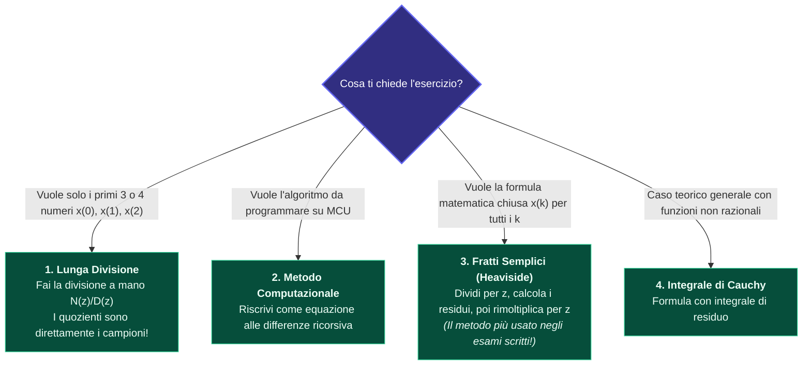

---
aliases:
  - Antitrasformata Z
  - Inversione Trasformata Z
tags:
  - università/sistemi-embedded
  - matematica
date: 2026-10-01
---

# 🔄 Antitrasformata Z — Come Tornare al Tempo

> [!ABSTRACT] Cosa Vuol Dire Antitrasformare a Parole Povere?
> Hai calcolato la funzione matematica $X(z)$ sul foglio.  
> Ora devi sapere: **cosa vede concretamente l'oscilloscopio o il microcontrollore nel tempo ($x_0, x_1, x_2, \dots$)?**  
> L'antitrasformata Z è il viaggio di ritorno dal dominio $z$ al tempo discreto $k$.

---

## 🧭 1. Grafico Decisionale: Quale Metodo Scegliere all'Esame?



---

## 1️⃣ Metodo 1: La Lunga Divisione (Banalissima Divisione tra Polinomi)

Se hai $X(z) = \frac{N(z)}{D(z)}$, fai la divisione a colonna ordinando per potenze decrescenti:

```text
       Numeratore N(z)  | Denominatore D(z)
      -                 +--------------------------
       ...              | c_0 + c_1·z⁻¹ + c_2·z⁻² + ...
                        |   |     |       |
                        |  x(0)  x(1)    x(2)  ...
```

I coefficienti del quoziente sono **esattamente i valori numerici nel tempo**:
$$x(0) = c_0, \quad x(1) = c_1, \quad x(2) = c_2, \quad \dots$$

---

## 2️⃣ Metodo 2: Il Metodo Computazionale (Per Scrivere il Firmware)

Moltiplica numeratore e denominatore in forma $z^{-1}$ per l'ingresso $U(z)$:
$$X(z) \cdot D(z^{-1}) = U(z) \cdot N(z^{-1})$$
Ricordando che moltiplicare per $z^{-1}$ significa ritardo temporale $x_{k-1}$, si ottiene direttamente l'**[[Equazioni alle Differenze|equazione alle differenze]]** da inserire nel codice C del microcontrollore!

---

## 3️⃣ Metodo 3: Fratti Semplici (Heaviside) — La Formula Chiusa

> [!IMPORTANT] Il Segreto del Metodo: Perché Dividere per $z$?
> Nella tabella delle trasformate notevoli, tutte le formule base hanno una $z$ al numeratore:
> $$\frac{z}{z - p} \quad \Longleftrightarrow \quad (p)^k$$
> Per questo motivo non scomponiamo $X(z)$, ma scomponiamo **$\dfrac{X(z)}{z}$**!

### La ricetta in 3 passi:
1. **Passo 1:** Prendi la funzione e dividila per $z$:  
   $$G(z) = \frac{X(z)}{z}$$
2. **Passo 2:** Scomponila in fratti semplici con i residui:  
   $$\frac{X(z)}{z} = \frac{R_1}{z - p_1} + \frac{R_2}{z - p_2} + \dots \qquad \text{dove } R_i = \lim_{z \to p_i} (z - p_i) \frac{X(z)}{z}$$
3. **Passo 3:** Rimoltiplica tutto per $z$:  
   $$X(z) = R_1 \frac{z}{z - p_1} + R_2 \frac{z}{z - p_2} + \dots$$
4. **Passo 4:** Scrivi direttamente il risultato nel tempo:  
   $$\mathbf{x(k) = R_1 (p_1)^k + R_2 (p_2)^k + \dots}$$

*Finito! Nessun integrale, nessun calcolo infinito.*

---

### 🧭 Navigazione
- ⬆️ **Nodo Padre:** [[Trasformata Z]]
