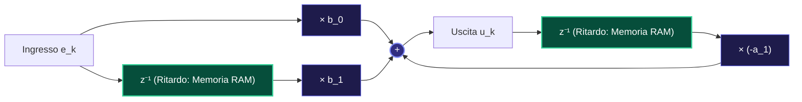
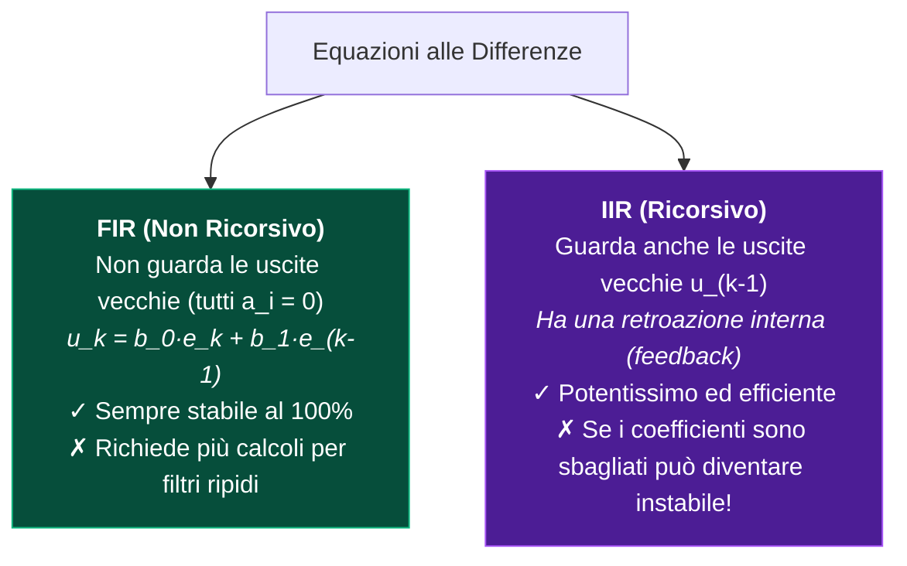

---
aliases:
  - Equazioni alle Differenze
  - Equazioni Ricorsive
tags:
  - università/sistemi-embedded
  - tempo-discreto
date: 2026-10-01
---

# 🔢 Equazioni alle Differenze — Il Cervello del Microcontrollore

> [!ABSTRACT] L'Idea in Breve
> Un'**equazione alle differenze** è semplicemente la **ricetta di calcolo** che il microcontrollore esegue ad ogni battito di clock.  
> Dice alla CPU: *"Per calcolare l'uscita attuale $u_k$, prendi gli ingressi appena letti e sommali alle uscite calcolate nei passi precedenti memorizzate nella RAM"*.

---

## 🏗️ 1. Grafico a Blocchi dell'Equazione

La forma generale di un sistema discreto è:
$$u_k = \underbrace{-a_1 u_{k-1} - a_2 u_{k-2}}_{\text{Uscite Passate (Memoria)}} + \underbrace{b_0 e_k + b_1 e_{k-1}}_{\text{Ingressi Attuali e Passati}}$$

Nel mondo hardware, questo si disegna così:



> [!IMPORTANT] Cos'è la Scatola $z^{-1}$?
> La vedi ovunque nei libri di ingegneria: **$z^{-1}$ significa semplicemente un RITARDO di 1 passo temporale $T$**.  
> Nella pratica hardware di un microcontrollore, $z^{-1}$ è una banale cella di memoria RAM in cui salvi una variabile per usarla al ciclo successivo!

---

## 🔁 2. Grafico: I Due Tipi di Sistemi (IIR vs FIR)



---

## 💻 3. Come Funziona nel Firmware di una MCU

Nei microcontrollori reali (STM32, ESP32, Arduino) l'algoritmo viene eseguito a intervallo fisso con un timer:

```text
  Timer Clock (ogni T ms)
    |
    v
  [1. Leggi ADC]  -->  [2. Calcola u_k = -a1*u_old + b0*e_k]  -->  [3. Scrivi DAC]
                                  |
                                  v
                        [4. Salva u_old = u_k]
```

```c
float u_old = 0.0f; // Variabile statica (memoria z^-1)

void Timer_Interrupt(void) {
    float e_k = Read_ADC();
    float u_k = -a1 * u_old + b0 * e_k; // Equazione alle differenze
    Write_DAC(u_k);
    u_old = u_k; // Aggiornamento stato
}
```

---

### 🧭 Navigazione
- ⬆️ **Origine Continua:** [[Equazioni Differenziali]]
- ➡️ **Come Risolverle Algebricamente:** [[Trasformata Z]]
