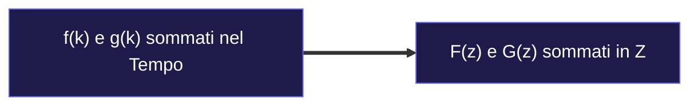

---
aliases:
  - Proprietà Trasformata Z
  - Teoremi Trasformata Z
tags:
  - università/sistemi-embedded
  - matematica
date: 2026-10-01
---

# ⚙️ Proprietà e Teoremi della Trasformata Z Spiegati a Parole

> [!ABSTRACT] Perché Servono le Proprietà?
> Invece di ricalcolare ogni volta la sommatoria infinita $\sum x_k z^{-k}$, le proprietà sono **scorciatoie di calcolo** che permettono di manipolare i segnali in pochi secondi.

---

## 1️⃣ Linearità: "La Somma Fa la Somma"

Se sommi due segnali nel tempo, nel dominio Z semplicemente sommi le loro trasformate:

$$\mathcal{Z}[a \cdot f(kT) + b \cdot g(kT)] = a \cdot F(z) + b \cdot G(z)$$



---

## 2️⃣ Ritardo Temporale: "Ritardare di 1 Passo = Moltiplicare per $z^{-1}$"

Questo è il teorema più importante dell'ingegneria del controllo:

$$\mathcal{Z}[x(k - n)] = z^{-n} X(z)$$

```text
  Segnale originale x(k):      [x_0, x_1, x_2, x_3, ...]  --->  X(z)
  Ritardato di 1 passo x(k-1): [ 0 , x_0, x_1, x_2, ...]  --->  z⁻¹ · X(z)
  Ritardato di 2 passi x(k-2): [ 0 ,  0 , x_0, x_1, ...]  --->  z⁻² · X(z)
```

> [!NOTE] Dimostrazione in 2 Passaggi Spiegata a Parole
> 1. Scriviamo la definizione spostata nel tempo:  
>    $\sum_{k=0}^{\infty} x(k - n) z^{-k}$
> 2. Raccogliamo fuori $z^{-n}$ per rimettere in fase gli esponenti:  
>    $= z^{-n} \sum_{k=0}^{\infty} x(k - n) z^{-(k-n)}$
> 3. Poiché il segnale parte da zero, la sommatoria è identica a quella originale $X(z)$:  
>    $= z^{-n} \cdot X(z) \quad \blacksquare$

---

## 3️⃣ Teorema del Valore Iniziale: "Cosa Succede al Tempo Zero?"

Vuoi sapere quanto vale il primissimo campione $x(0)$ senza fare tutta l'inversione?  
Basta mandare $z$ all'infinito:

$$\mathbf{x(0) = \lim_{z \to \infty} X(z)}$$

```text
  X(z) = x(0) + x(1)·(1/z) + x(2)·(1/z²) + x(3)·(1/z³) + ...
                 \_______/    \________/    \________/
                     |             |             |
  Se z -> ∞ :     tende a 0     tende a 0     tende a 0
  
  Rimane SOLO:  x(0) !
```

---

## 4️⃣ Teorema del Valore Finale: "Dove si Assesta il Sistema a Regime?"

Vuoi sapere a quale valore costante si stabilizzerà l'uscita per $k \to \infty$ (il valore di regime)?  
Basta fare questo semplice limite per $z \to 1$:

$$\mathbf{\lim_{k \to \infty} x(kT) = \lim_{z \to 1} \left[ (1 - z^{-1}) X(z) \right] = \lim_{z \to 1} \left[ \frac{z-1}{z} X(z) \right]}$$

```text
  y ^
    |                 . - - - - - - - Valore a Regime x(∞)
    |          . - '
    |      . '
    |   . '
    +--+---+---+---+---+---+-----> k
       0   1   2   3   4   k -> ∞
```

> [!CAUTION] Quando NON si può usare?
> Funziona **solo se il sistema è stabile** (tutti i poli dentro il cerchio unitario $|p| < 1$, con al più un polo in $z=1$).  
> Se il sistema oscilla per sempre (come un'onda sinusoidale) o esplode all'infinito, il limite restituisce un numero che non corrisponde alla realtà fisica!

---

### 🧭 Navigazione
- ⬆️ **Nodo Padre:** [[Trasformata Z]]
