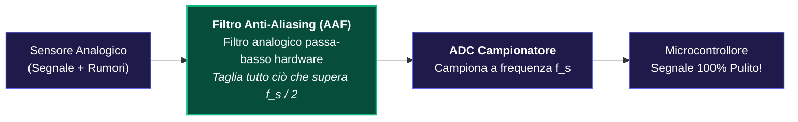

---
aliases:
  - Teorema di Shannon
  - Aliasing
  - Frequenza di Nyquist
tags:
  - università/sistemi-embedded
  - campionamento
date: 2026-10-01
---

# 🛡️ Teorema di Shannon e Aliasing — La Regola d'Oro

> [!ABSTRACT] L'Idea in Breve
> A che velocità minima dobbiamo campionare un segnale per non perdere informazioni?  
> Il **Teorema di Shannon** risponde: **ad una frequenza pari ad almeno il DOPPIO della massima frequenza presente nel segnale!**  
> Se scatti le foto più lentamente, si verifica l'**Aliasing**: le frequenze alte si travestono da frequenze basse, distruggendo per sempre il segnale originale.

---

## 📐 1. La Formula di Nyquist-Shannon

Sia $\omega_c$ la frequenza/pulsazione massima contenuta nel segnale continuo ($f_{max}$ in Hertz):

$$\mathbf{\omega_s \ge 2 \cdot \omega_c \quad \Longleftrightarrow \quad f_s \ge 2 \cdot f_{max}}$$

- **Pulsazione di Nyquist:** $\omega_N = \dfrac{\omega_s}{2}$ (la massima frequenza teoricamente visibile).
- **Tempo massimo tra due campioni:** $T_{max} = \dfrac{1}{2 f_{max}}$.

---

## 🎨 2. Grafico: Campionamento Corretto vs Disastro dell'Aliasing

Guarda cosa succede alle frequenze quando rispetti Shannon rispetto a quando campioni troppo piano:

<svg viewBox="0 0 540 300" width="100%" style="background:#0f172a; border-radius:8px; margin: 15px 0;">
  <!-- CASO 1: SHANNON RISPETTATO -->
  <g transform="translate(30, 20)">
    <text x="0" y="0" fill="#10b981" font-family="system-ui, sans-serif" font-size="12" font-weight="bold">CASO 1: Shannon Rispettato (ω_s ≥ 2·ω_c) — Nessuna Sovrapposizione</text>
    <line x1="20" y1="85" x2="460" y2="85" stroke="#475569" stroke-width="1.5" />
    <line x1="160" y1="95" x2="160" y2="15" stroke="#475569" stroke-width="1.5" />

    <!-- Banda Base -->
    <polygon points="90,85 160,25 230,85" fill="#38bdf8" fill-opacity="0.3" stroke="#38bdf8" stroke-width="2" />
    <text x="160" y="100" text-anchor="middle" fill="#38bdf8" font-family="system-ui, sans-serif" font-size="10">0</text>
    <text x="230" y="100" text-anchor="middle" fill="#38bdf8" font-family="system-ui, sans-serif" font-size="10">+ωc</text>

    <!-- Replica distanziata -->
    <polygon points="290,85 360,25 430,85" fill="#14b8a6" fill-opacity="0.25" stroke="#14b8a6" stroke-width="2" />
    <text x="360" y="100" text-anchor="middle" fill="#14b8a6" font-family="system-ui, sans-serif" font-size="10">ωs</text>
    <text x="290" y="100" text-anchor="middle" fill="#14b8a6" font-family="system-ui, sans-serif" font-size="10">ωs - ωc</text>

    <!-- Spazio libero verde -->
    <line x1="230" y1="55" x2="290" y2="55" stroke="#10b981" stroke-width="2" />
    <text x="260" y="48" text-anchor="middle" fill="#10b981" font-family="system-ui, sans-serif" font-size="10" font-weight="bold">Separati (OK!)</text>
  </g>

  <!-- CASO 2: ALIASING / SOVRAPPOSIZIONE -->
  <g transform="translate(30, 160)">
    <text x="0" y="0" fill="#f43f5e" font-family="system-ui, sans-serif" font-size="12" font-weight="bold">CASO 2: Aliasing Irreversibile (ω_s &lt; 2·ω_c) — Scontro di Frequenze</text>
    <line x1="20" y1="85" x2="460" y2="85" stroke="#475569" stroke-width="1.5" />
    <line x1="160" y1="95" x2="160" y2="15" stroke="#475569" stroke-width="1.5" />

    <!-- Banda Base -->
    <polygon points="80,85 160,25 240,85" fill="#38bdf8" fill-opacity="0.25" stroke="#38bdf8" stroke-width="2" />

    <!-- Replica che invade -->
    <polygon points="190,85 270,25 350,85" fill="#14b8a6" fill-opacity="0.25" stroke="#14b8a6" stroke-width="2" />

    <!-- Zona sovrapposizione in rosso -->
    <polygon points="190,85 215,62 240,85" fill="#f43f5e" fill-opacity="0.7" stroke="#f43f5e" stroke-width="2" />
    <text x="215" y="50" text-anchor="middle" fill="#f43f5e" font-family="system-ui, sans-serif" font-size="10" font-weight="bold">SOVRAPPOSIZIONE!</text>

    <text x="160" y="100" text-anchor="middle" fill="#94a3b8" font-family="system-ui, sans-serif" font-size="10">0</text>
    <text x="270" y="100" text-anchor="middle" fill="#94a3b8" font-family="system-ui, sans-serif" font-size="10">ωs</text>
  </g>
</svg>

---

## 🕒 3. Grafico nel Tempo: L'Inganno dei Campioni

Perché due onde completamente diverse possono sembrare identiche al computer?

<svg viewBox="0 0 540 180" width="100%" style="background:#0f172a; border-radius:8px; margin: 15px 0;">
  <line x1="40" y1="90" x2="500" y2="90" stroke="#475569" stroke-width="1.5" />
  <line x1="60" y1="160" x2="60" y2="20" stroke="#475569" stroke-width="1.5" />
  <text x="505" y="94" fill="#94a3b8" font-family="system-ui, sans-serif" font-size="11">Tempo t</text>

  <!-- Onda Lenta Reale (Blu) -->
  <path d="M 60,90 Q 135,15 210,90 T 360,90 T 510,90" fill="none" stroke="#38bdf8" stroke-width="3" />
  <text x="140" y="28" fill="#38bdf8" font-family="system-ui, sans-serif" font-size="12" font-weight="bold">Onda Lenta Reale</text>

  <!-- Onda Veloce Disturbo (Arancione tratteggiata) -->
  <path d="M 60,90 Q 97.5,15 135,90 T 210,90 T 285,90 T 360,90 T 435,90 T 510,90" fill="none" stroke="#f59e0b" stroke-width="2" stroke-dasharray="4" />
  <text x="390" y="155" fill="#f59e0b" font-family="system-ui, sans-serif" font-size="12" font-weight="bold">Onda Veloce (Disturbo)</text>

  <!-- Punti campionati coincidenti (Rossi) -->
  <circle cx="60" cy="90" r="5" fill="#f43f5e" />
  <circle cx="210" cy="90" r="5" fill="#f43f5e" />
  <circle cx="360" cy="90" r="5" fill="#f43f5e" />
  <circle cx="510" cy="90" r="5" fill="#f43f5e" />

  <text x="210" y="115" text-anchor="middle" fill="#f43f5e" font-family="system-ui, sans-serif" font-size="11" font-weight="bold">I campioni registrati dall'ADC coincidono perfettamente!</text>
</svg>

> [!CAUTION] Danno Irreversibile
> Il microcontrollore riceve solo i cerchietti rossi: non può sapere se l'onda reale era quella blu o quella arancione!  
> L'informazione originaria è persa e nessun filtro software potrà mai più distinguerla.

---

## 🎛️ 4. La Soluzione: Il Filtro Anti-Aliasing (AAF)

Dato che l'aliasing non si può correggere via software, **nei sistemi embedded si inserisce obbligatoriamente un filtro passa-basso analogico prima dell'ADC**:

> [!TIP] Regola Pratica dell'Ingegnere
> Nella teoria basta $f_s \ge 2 f_{max}$. Ma nella realtà i filtri fisici non tagliano verticalmente.  
> Per sicurezza si campiona a **5 - 10 volte** la banda massima del segnale:
> $$\mathbf{f_s \approx (5 \div 10) \cdot f_{max}}$$

---

### 🧭 Flusso di Elaborazione
- ⬅️ **Passo Precedente:** [[Spettro del Segnale Campionato]]
- ➡️ **Passo Successivo (Come Ricostruire il Segnale):** [[Ricostruzione e Tenitore ZOH]]
