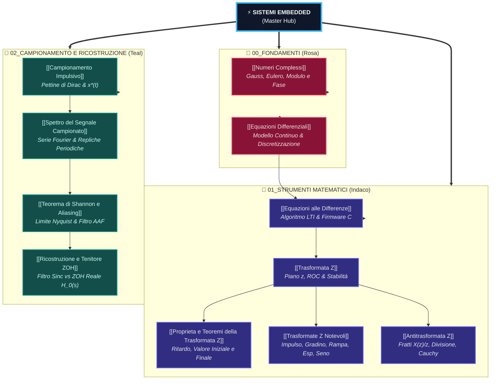

---
aliases:
  - Sistemi Embedded
  - Controllo Digitale
  - Master Hub Sistemi Embedded
tags:
  - università/sistemi-embedded
  - hub
date: 2026-10-01
---

# ⚡ Sistemi Embedded — Master Hub

> [!ABSTRACT] 📌 Quadro Generale del Corso per Ingegneria
> Questa nota rappresenta il **Master Hub** per lo studio di **Sistemi Embedded & Controllo Digitale**.  
> Funge da guida sintetica per l'esame: per ciascun tema trovi il **concetto fondamentale**, la **formula d'oro** e il link diretto alla relativa nota di dettaglio contenente le **dimostrazioni passo-passo** e le analisi approfondite.

---

## 🎛️ 1. L'Architettura Completa del Sistema di Controllo Embedded

Un sistema embedded di controllo si colloca all'interfaccia tra il **mondo fisico continuo** (motori, temperature, circuiti) e il **mondo numerico discreto** (CPU, registri, memoria):

```mermaid
flowchart LR
    REF["Riferimento r(kT)"] --> SUM(( + / - ))
    SUM --> ERROR["Errore e(kT)"]
    
    subgraph MCU ["💻 Microcontrollore (Tempo Discreto)"]
        direction TB
        ALGO["<b>Firmware / ISR Timer</b><br/>[[Equazioni alle Differenze]]<br/>[[Trasformata Z]]"]
    end

    ERROR --> ALGO
    ALGO -->|"u(kT)"| DAC["<b>DAC / [[Ricostruzione e Tenitore ZOH|ZOH]]</b><br/>H_0(s) = (1-e⁻ˢᵀ)/s"]
    DAC -->|"u_r(t)"| PLANT["<b>Impianto Fisico</b><br/>Continuo G(s)"]
    PLANT -->|"y(t)"| SENSOR["Sensore Fisico"]
    
    SENSOR -->|"y_m(t)"| AAF["<b>Filtro Anti-Aliasing</b><br/>Passa-Basso Analogico"]
    AAF --> ADC["<b>ADC / [[Campionamento Impulsivo|Campionatore]]</b><br/>Passo T (f_s)"]
    ADC -->|"y(kT)"| SUM

    classDef embNode fill:#312e81,stroke:#6366f1,stroke-width:2px,color:#fff;
    classDef anaNode fill:#134e4a,stroke:#14b8a6,stroke-width:2px,color:#fff;
    classDef plantNode fill:#1e293b,stroke:#94a3b8,stroke-width:1px,color:#f8fafc;

    class ALGO embNode;
    class DAC,ADC,AAF anaNode;
    class PLANT,SENSOR,REF,ERROR plantNode;
```

### 💡 Il Giro del Segnale a Parole Povere:
1. **Sensore & [[Teorema di Shannon e Aliasing|Filtro Anti-Aliasing (AAF)]]:** Il sensore legge la realtà fisica (es. temperatura o velocità). Il filtro analogico elimina i rumori ad alta frequenza per evitare che ingannino il campionatore.
2. **[[Campionamento Impulsivo|ADC (Campionatore)]]:** Scatta una "foto" della tensione ogni $T$ secondi e la trasforma in numeri interi $\{y_k\}$ leggibili dal processore.
3. **Microcontrollore ([[Equazioni alle Differenze]] & [[Trasformata Z]]):** Esegue la ricetta di controllo nel firmware e decide quanto spingere l'attuatore calcolando il nuovo numero $u_k$.
4. **[[Ricostruzione e Tenitore ZOH|DAC & ZOH (Tenitore)]]:** Riceve il numero $u_k$ e mantiene costante la tensione fisica corrispondente fino al prossimo campione (creando una curva a gradini).
5. **Impianto Fisico:** Il motore o la valvola riceve la tensione e si muove nel mondo reale continuo.

---

## 📋 2. Quadro Sinottico: Cosa C'è da Sapere per Ogni Argomento

| Modulo | Argomento & Nota                                | 🎯 Concetto Chiave da Sapere                                                                              | 📌 Formula Fondamentale                                                                                       | 💡 Intuizione Fisica per Ingegneria                                                                        |
| ------ | ----------------------------------------------- | --------------------------------------------------------------------------------------------------------- | ------------------------------------------------------------------------------------------------------------- | ---------------------------------------------------------------------------------------------------------- |
| **00** | **[[Numeri Complessi]]**                        | Forme cartesiana ed esponenziale; modulo e fase; formula di Eulero.                                       | $e^{j\theta} = \cos\theta + j\sin\theta$ $z = e^{sT} = e^{\sigma T} e^{j\omega T}$                        | Moltiplicare per $e^{j\theta}$ significa ruotare la freccia; modulo = ampiezza, fase = oscillazione.       |
| **00** | **[[Equazioni Differenziali]]**                 | Dal continuo $\dot{x}(t)$ al discreto $u_k$; perché la CPU lavora a scatti $T$.                           | $\left.\frac{du}{dt}\right\|_{kT} \approx \frac{u_k - u_{k-1}}{T}$ $u_k = \alpha u_{k-1} + (1-\alpha)e_k$ | Sostituendo la derivata con la differenza finita nasce spontaneamente il filtro digitale in C.             |
| **01** | **[[Equazioni alle Differenze]]**               | Modello discreto LTI; memoria ricorsiva (IIR) vs media mobile (FIR).                                      | $u_k = -\sum a_i u_{k-i} + \sum b_j e_{k-j}$                                                                  | L'operatore $z^{-1}$ equivale a salvare un dato nella RAM per usarlo al ciclo di timer successivo.         |
| **01** | **[[Trasformata Z]]**                           | Converte i ritardi temporali in moltiplicazioni algebriche per $z^{-1}$.                                  | $X(z) = \sum_{k=0}^\infty x_k z^{-k}$ $z = e^{sT}$                                                        | Il semipiano sinistro continuo $\text{Re}(s)<0$ collassa dentro il cerchio unitario $\lvert z \rvert < 1$. |
| **01** | **[[Proprieta e Teoremi della Trasformata Z]]** | Linearità; ritardo $z^{-n}$; Teorema del Valore Iniziale e Valore Finale.                                 | $x(0) = \lim_{z \to \infty} X(z)$ $x(\infty) = \lim_{z \to 1} (1-z^{-1})X(z)$                             | Il valore iniziale manda a zero le potenze negative; il valore finale richiede poli stabili.               |
| **01** | **[[Trasformate Z Notevoli]]**                  | I 5 segnali canonici: impulso, gradino, rampa, esponenziale, seno e coseno.                               | $\delta_0 \to 1, \quad 1(k) \to \frac{z}{z-1}$ $e^{-at} \to \frac{z}{z-e^{-aT}}$                          | L'esponenziale decrescente ha un polo reale dentro il cerchio; la sinusoide ha poli coniugati.             |
| **01** | **[[Antitrasformata Z]]**                       | I 4 metodi: Lunga divisione, Computazionale, Fratti Heaviside con $X(z)/z$, Cauchy.                       | $\frac{X(z)}{z} = \sum \frac{R_i}{z - p_i}$ $x_k = \sum R_i (p_i)^k$                                      | Dividiamo per $z$ per riottenere termini base $\frac{z}{z-p_i}$ la cui antitrasformata è immediata.        |
| **02** | **[[Campionamento Impulsivo]]**                 | Modello ad interruttore/pettine di Dirac; spettro di Laplace di $x^*(t)$ e legame $z = e^{sT}$.           | $x^*(t) = x(t) \sum \delta(t-kT)$ $X^*(s) = \sum x(kT) e^{-kTs}$                                          | Campionare equivale a moltiplicare il segnale continuo per una fila di aghi ad intervalli $T$.             |
| **02** | **[[Spettro del Segnale Campionato]]**          | Serie di Fourier del pettine; periodizzazione dello spettro a frequenze multiple di $\omega_s$.           | $X^*(j\omega) = \frac{1}{T} \sum_{n} X(j(\omega - n\omega_s))$                                                | Campionare nel tempo clona lo spettro all'infinito a passi regolari di $\omega_s = 2\pi/T$.                |
| **02** | **[[Teorema di Shannon e Aliasing]]**           | Frequenza minima $\omega_s \ge 2\omega_c$; ripiegamento spettrale e filtro anti-aliasing prima dell'ADC.  | $\omega_s \ge 2\omega_c \iff f_s \ge 2 f_{max}$ Filtro AAF passa-basso                                    | Se $\omega_s < 2\omega_c$ le copie si scontrano e generano frequenze fantasma irreversibili.               |
| **02** | **[[Ricostruzione e Tenitore ZOH]]**            | Ricostruttore ideale sinc (non causale); Tenitore ZOH a gradini reale, risposta $H_0(s)$ e ritardo $T/2$. | $H_0(s) = \frac{1 - e^{-Ts}}{s}$ $\tau_{delay} = \frac{T}{2}$                                             | Il DAC tiene ferma la tensione analogica tra un campione e l'altro introducendo un ritardo di $T/2$.       |

---

## 🌳 3. Mappa Concettuale Ramificata ad Albero Puro

La struttura segue una **rigorosa gerarchia di dipendenza**, evitando collegamenti deboli tra note non direttamente collegate:

---

## 🧭 Percorso di Studio Consigliato

1. **Prerequisiti (Sezione 00):**
   - Ripassa l'algebra polare e le formule di Eulero in **[[Numeri Complessi]]**.
   - Comprendi come un circuito fisico reale $\tau \dot{y} + y = u$ si trasforma in codice numerico in **[[Equazioni Differenziali]]**.
2. **Dominio Discreto e Trasformata Z (Sezione 01):**
   - Studia la struttura delle **[[Equazioni alle Differenze]]** e implementale in C.
   - Passa al dominio algebrico con la **[[Trasformata Z]]** e il criterio di stabilità $|z| < 1$.
   - Approfondisci con le **[[Proprieta e Teoremi della Trasformata Z]]**, la tabella delle **[[Trasformate Z Notevoli]]** e impara a tornare indietro nel tempo con l'**[[Antitrasformata Z]]**.
3. **Interfacciamento con la Realtà Fisica (Sezione 02):**
   - Modella l'ADC mediante il **[[Campionamento Impulsivo]]**.
   - Scopri perché compaiono infinite repliche spettrali in **[[Spettro del Segnale Campionato]]**.
   - Proteggi il sistema dai disturbi irreversibili studiando il **[[Teorema di Shannon e Aliasing]]**.
   - Scopri come il DAC riconverte i bit in tensione tramite la **[[Ricostruzione e Tenitore ZOH]]**.
