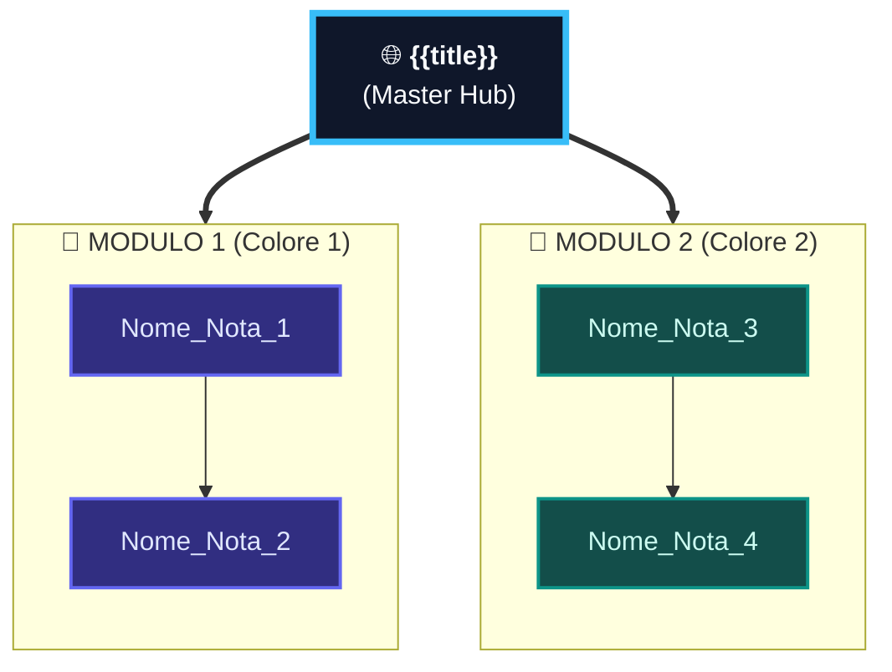

---
aliases:
  - {{title}}
  - File Principale {{title}}
  - Master Hub {{title}}
tags:
  - università/{{materia_tag}}
  - hub
date: {{date}}
---

# 🌐 {{title}} — Master Hub

> [!ABSTRACT] 📌 Master Hub del Corso
> Questa nota rappresenta il **File Principale** del corso di **{{title}}**.  
> Funge da bussola interconnessa per lo studio: per ciascun argomento trovi il **concetto chiave**, la **formula/regola d'oro** e il link diretto alla nota di dettaglio con le dimostrazioni ed esempi pratici.

---

## 🏗️ 1. Architettura Complessiva della Materia

---

## 📋 2. Quadro Sinottico: Cosa C'è da Sapere per Ogni Argomento

| Modulo | Argomento & Nota | 🎯 Concetto Chiave da Sapere | 📌 Formula / Risultato d'Oro | 💡 Intuizione per Ingegneria |
|---|---|---|---|---|
| **01** | **Nome_Nota_1** | Concetto fondamentale riassunto in 1 riga | Formula matematica o standard chiave | Perché serve all'ingegnere / significato pratico |
| **02** | **Nome_Nota_2** | Concetto fondamentale riassunto in 1 riga | Formula matematica o standard chiave | Perché serve all'ingegnere / significato pratico |

---

## 🌳 3. Mappa Concettuale Ramificata ad Albero Puro

> [!IMPORTANT] Regola del Vault
> Mantenere una gerarchia pulita senza ragnatele: collegare i moduli all'Hub e le note foglia esclusivamente al loro tema o passo propedeutico.

---

## 🧭 4. Percorso di Studio Consigliato

1. **Fase 1 — Fondamenti:** *Nome_Nota_1*
2. **Fase 2 — Strumenti & Analisi:** *Nome_Nota_2*
3. **Fase 3 — Applicazione & Progetto:** *Nome_Nota_3*
