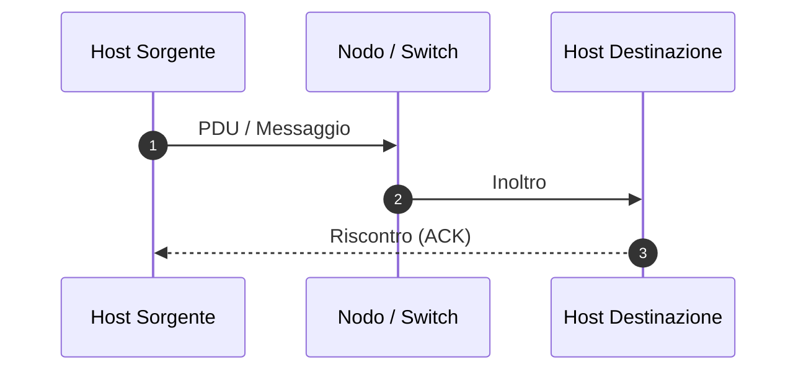

---
aliases:
  - {{title}}
tags:
  - università/reti-di-calcolatori
  - reti
  - {{sezione_tag}}
date: {{date}}
---

# 🌐 {{title}}

Definizione sintetica del protocollo, architettura o meccanismo trasmissivo nel contesto delle reti di telecomunicazione.

---

## 🎯 1. Contesto Architetturale (ISO/OSI & IEEE 802)

Specificare a quale livello appartiene e che servizio fornisce:

> [!INFO] Scheda Tecnica del Protocollo/Meccanismo
> - **Livello ISO/OSI:** Livello X (es. Fisico, Collegamento, Rete, Trasporto)
> - **Unità Dati (PDU):** Bit / Frame / Pacchetto / Segmento
> - **Standard di riferimento:** es. IEEE 802.3, IEEE 802.11, RFC ...
> - **Obiettivo:** Trasferimento affidabile, instradamento, controllo di flusso, ecc.

### 🌐 Topologia di Rete (Excalidraw Cisco)
*Per schemi architetturali e topologie con icone Cisco (Router, Switch, Firewall, Cloud):*
`![[Topologia_{{title}}.excalidraw]]`

---

## ⚙️ 2. Meccanismo di Funzionamento & Formato del Frame/Pacchetto

Descrizione strutturata dei campi dell'header o delle fasi operative dell'algoritmo:

| Campo Header | Dimensione | Descrizione e Funzione |
|---|---|---|
| **Preambolo** | 7 Byte | Sincronizzazione clock ricevitore |
| **Indirizzo Destinazione** | 6 Byte | Indirizzo MAC/IP destinatario |
| **Dati (Payload)** | 46 - 1500 Byte | PDU del livello superiore |
| **FCS / CRC** | 4 Byte | Controllo di errore di trasmissione |

---

## 📊 3. Analisi Prestazionale & Formule Matematiche

Formule ingegneristiche per il calcolo di ritardo, banda, throughput o efficienza di canale:

$$T_{tot} = T_{tx} + T_{prop} + T_{coda} + T_{elab}$$

- **Tempo di Trasmissione:** $T_{tx} = \dfrac{L}{R}$ (dove $L$ è la lunghezza del pacchetto in bit, $R$ la capacità del canale in bit/s).
- **Tempo di Propagazione:** $T_{prop} = \dfrac{d}{v}$ (dove $d$ è la distanza fisica, $v$ la velocità di propagazione nel mezzo $\approx 2 \cdot 10^8\text{ m/s}$).

---

## 🧭 Navigazione Gerarchica

- ⬆️ **Nodo Padre:** [[Nome_Hub_o_Modulo]]
- ➡️ **Passo Successivo:** [[Prossimo_Argomento]]
